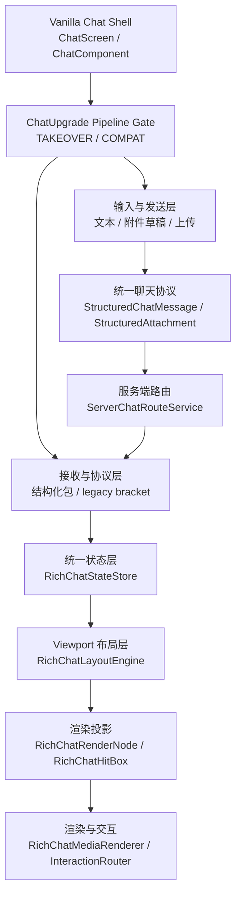
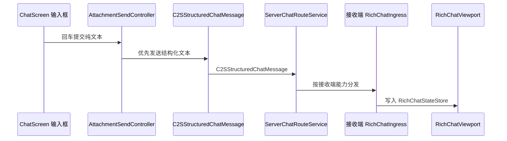
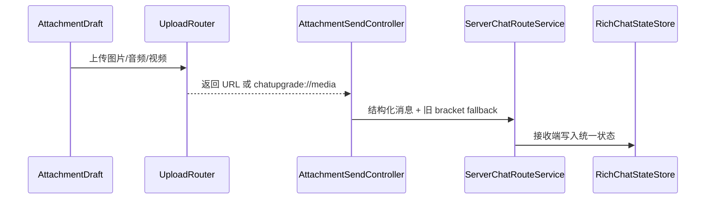

# 项目总架构

这篇文档说明 Chat Upgrade 当前的整体结构。它不按源码逐段解释，而是按模块职责、数据流和边界组织。

## 项目定位

Chat Upgrade 是 Fabric Minecraft 模组，用于把聊天消息升级为富媒体聊天：

- 普通文本仍可显示。
- 图片、音频、视频可以作为聊天附件展示。
- `[:token]` 行内表情可以解析并渲染为图片。
- 客户端可通过文件选择、剪贴板、命令等方式发送附件。
- 服务端安装模组后可以承担媒体上传、metadata 存储和多客户端分发。
- 未安装新客户端的接收方仍可以收到安全降级文本或旧 `[[ChatUpgrade,...]]` 载荷。

## 运行模式

| 模式 | 目标 | 纯文本 | 附件 | 渲染事实来源 |
| --- | --- | --- | --- | --- |
| `TAKEOVER` | 默认完整接管聊天内容区 | 进入统一协议/状态层 | 进入统一协议/状态层 | `RichChatStateStore` |
| `COMPAT_TEXT_VANILLA` | 降低与其它聊天类模组冲突 | 尽量走原版链路 | 保留富媒体路径 | 原版文本链路 + 附件兼容投影 |

默认模式是 `TAKEOVER`。配置文件没有 `chatInputMode` 字段时，运行时等价于 `TAKEOVER`。只有显式配置为 `COMPAT_TEXT_VANILLA` 才进入兼容文本模式。

## 总体层级



## 保留的原版外壳

项目没有完全替换整个聊天 Screen，而是保留 Vanilla Chat Shell。

保留内容包括：

- 聊天栏位置、宽度、高度和缩放。
- 聊天透明度、背景透明度、打开/关闭、focused 状态。
- 输入框、命令输入、最近聊天记录入口。
- 原版聊天设置联动。
- Minecraft GUI 渲染生命周期、鼠标坐标和 tooltip/cursor 桥接。

这部分可以理解为“红色外壳”。

## TAKEOVER 接管的内容区

`TAKEOVER` 接管的是聊天栏内部内容区，也就是“黄色内容”。

接管后，聊天内容不再以原版 `GuiMessage.Line` 为事实来源，而是以统一状态层为事实来源：

```text
RichChatMessage
  -> RichChatMessageLayout
  -> RichChatRenderNode[]
  -> RichChatHitBox[]
  -> RichChatMediaRenderer / RichChatInteractionRouter
```

因此，在聊天栏范围内可以自定义渲染文本、表情、图片、音频、视频、按钮、进度条、卡片等内容。仍需尊重的是外层聊天栏矩形和原版 shell 生命周期。

## 客户端模块

| 模块 | 主要路径 | 职责 |
| --- | --- | --- |
| 初始化与命令 | `src/client/java/com/chat/upgrade/client/ChatUpgradeClient.java` | 客户端入口、命令注册、插件预热、资源清理。 |
| 配置 | `src/client/java/com/chat/upgrade/client/ChatUpgradeConfig.java` | 客户端配置、默认值、范围归一化、保存/重载。 |
| 输入草稿 | `src/client/java/com/chat/upgrade/client/ui/chat/input` | 单附件草稿、剪贴板/文件来源、发送控制。 |
| 聊天状态 | `src/client/java/com/chat/upgrade/client/ui/chat/state` | 统一消息事实层、投影兼容层。 |
| 富媒体 viewport | `src/client/java/com/chat/upgrade/client/ui/chat/viewport` | TAKEOVER 布局、渲染节点、命中框、滚动状态。 |
| 媒体加载 | `src/client/java/com/chat/upgrade/client/media` | 图片、音频、视频加载和缓存。 |
| 服务端媒体客户端 | `src/client/java/com/chat/upgrade/client/net/servermedia` | 服务端能力、上传/查询 future、结构化消息接收。 |
| Mixin 接入 | `src/client/java/com/chat/upgrade/client/mixin` | ChatScreen/ChatComponent 输入、渲染、滚动、点击入口。 |

## 服务端模块

| 模块 | 主要路径 | 职责 |
| --- | --- | --- |
| 服务端入口 | `src/main/java/com/chat/upgrade/ChatUpgrade.java` | payload 注册、服务端网络初始化。 |
| 统一协议 | `src/main/java/com/chat/upgrade/net` | payload、结构化聊天消息、附件、wire codec。 |
| 聊天路由 | `src/main/java/com/chat/upgrade/server/ServerChatRouteService.java` | 根据接收端能力和模式分发结构化/legacy/vanilla 消息。 |
| 媒体服务 | `src/main/java/com/chat/upgrade/server/ServerMediaService.java` | 媒体上传、请求、分块下发。 |
| 附件 metadata | `src/main/java/com/chat/upgrade/server/ServerAttachmentService.java` | 附件 metadata 提交、查询和缓存。 |
| 存储 | `src/main/java/com/chat/upgrade/server/store` | 内存/磁盘媒体存储。 |
| 服务端 Mixin | `src/main/java/com/chat/upgrade/mixin/ServerGamePacketListenerImplMixin.java` | 拦截旧聊天载荷并交给统一服务端路由。 |

## 关键数据流

### TAKEOVER 纯文本发送



### TAKEOVER 附件发送



### 兼容与旧协议

旧 `[[ChatUpgrade,...]]` 文本仍然保留：

- 新 TAKEOVER 客户端：解析后写入统一状态层。
- 新兼容客户端：走附件兼容投影或普通原版文本链路。
- 旧模组客户端：收到旧 bracket 载荷。
- vanilla 客户端：收到安全可读文本和链接提示。

## 架构原则

- `TAKEOVER` 的事实来源是 `RichChatStateStore`，不是 `GuiMessage.Line`。
- `GuiMessage.Line`、phantom 行和旧 HUD 叠加只作为兼容模式或旧协议兜底路径。
- 新的聊天内容形态应该扩展 viewport 状态、布局、节点、渲染和交互层。
- 兼容性优先放在 `COMPAT_TEXT_VANILLA`，不要让 TAKEOVER 为其它聊天显示类模组牺牲主架构。