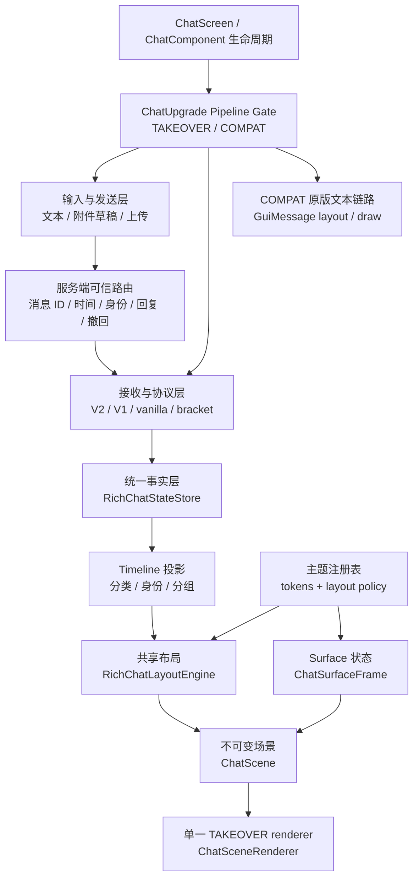
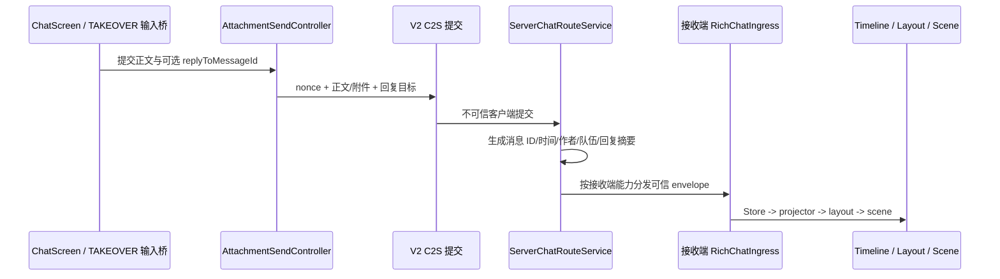
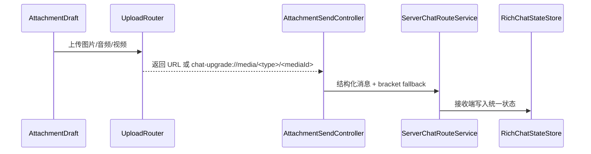

# 项目总架构

这篇文档说明 Chat Upgrade 当前的整体结构。它不按源码逐段解释，而是按模块职责、数据流和边界组织。

## 项目定位

Chat Upgrade 是 Minecraft 富媒体聊天模组，支持 **Fabric** 与 **NeoForge**，目标版本 **26.1 / 26.2**。用于把聊天消息升级为富媒体聊天：

- 普通文本仍可显示。
- 图片、音频、视频可以作为聊天附件展示。
- `[:token]` 行内表情可以解析并渲染为图片。
- 客户端可通过文件选择、剪贴板、命令等方式发送附件。
- 服务端安装模组后可以承担媒体上传、metadata 存储和多客户端分发。
- 未安装新客户端的接收方仍可以收到安全降级文本或 `[[ChatUpgrade,...]]` / `[[CICode,...]]` bracket 载荷。

## 运行模式

| 模式 | 目标 | 纯文本 | 附件 | 渲染事实来源 |
| --- | --- | --- | --- | --- |
| `TAKEOVER` | 默认拥有完整聊天 surface | 进入统一协议/状态层 | 进入统一协议/状态层 | `RichChatStateStore -> ChatTimelineProjector -> ChatScene` |
| `COMPAT_TEXT_VANILLA` | 保留原版文本兼容链路 | Minecraft 原版 `ChatComponent -> GuiMessage` | 保留隔离的富媒体兼容入口 | 原版文本布局/绘制 + 附件兼容投影 |

默认模式是 `TAKEOVER`。配置文件没有 `chatInputMode` 字段时，运行时等价于 `TAKEOVER`。只有显式配置为 `COMPAT_TEXT_VANILLA` 才进入兼容文本模式。

## 总体层级



## TAKEOVER surface 所有权

`TAKEOVER` 不再把 Minecraft 原版聊天矩形当作布局来源。`ChatSurfaceController` 维护左下锚定、可拖动、可缩放并持久化的 `ChatPanelGeometry`，根据聊天打开状态生成两种 presentation：

- `OPEN_PANEL`：完整交互面板，包含 header、timeline viewport 与 composer 区域。
- `CLOSED_HUD`：复用同一 surface 状态的紧凑淡出 HUD。

消息内容不以原版 `GuiMessage.Line` 为事实来源：

```text
RichChatStateStore (newest-first)
  -> ChatTimelineProjector (oldest-first)
  -> RichChatLayoutEngine (theme layout policy)
  -> ChatScene (immutable frame)
  -> ChatSceneRenderer
```

surface 几何与 scissor 使用 GUI 绝对坐标；消息节点使用内容局部坐标。文本、媒体、消息背景和 hit box 来自同一次布局，渲染层不能按主题再次改写坐标。

## 主题与共享场景

三套稳定主题 `modern_bubble`、`compact_feed`、`native_enhanced` 共用一套 scene/layout/render 管线：

- `ChatThemeTokens` 提供 surface、消息、身份、回复、删除、媒体、滚动条和 composer 的视觉语义。
- `ChatLayoutPolicy` 提供会改变布局与命中框的 gutter、padding、组间距和装饰策略。
- `ChatThemes` 只注册主题组合，不创建三个 renderer。
- `ChatSurfaceFrame` 固化当前帧主题；切换配置后下一帧重建必要布局，不修改消息事实、协议能力或动作语义。

## COMPAT 隔离

`COMPAT_TEXT_VANILLA` 的纯文本继续走 Minecraft 原版 `ChatComponent -> GuiMessage -> 原版布局/绘制`。TAKEOVER 的 metrics、surface 坐标、布局策略和运行时主题不得进入该链路。

兼容 HUD 仍可通过旧重载显示富媒体，但其媒体视觉固定使用 `native_enhanced`，避免 TAKEOVER 热切换泄漏。

## 工程与加载器分层

项目采用 **Stonecutter 多版本编排** + **各加载器原生工具链** + **自写平台抽象**，单一 `src/common` 源码树编译到多个目标：

```text
src/
  common/     # 加载器无关逻辑 + mixin + platform 抽象
  fabric/     # Fabric 入口与平台实现
  neoforge/   # NeoForge 入口与平台实现
```

| 层级 | 包/路径 | 职责 |
| --- | --- | --- |
| 公共入口 | `src/common/.../ChatUpgrade.java` | 服务端公共初始化（配置、媒体存储） |
| 平台抽象 | `src/common/.../platform` | `Platform`、`Net`、`CommandSink` 等接口 |
| Fabric 绑定 | `src/fabric/.../fabric/*` | `ModInitializer`、Fabric 网络/命令/事件实现 |
| NeoForge 绑定 | `src/neoforge/.../neoforge/*` | `@Mod`、NeoForge payload/事件实现 |

技术 mod id 为 `chatupgrade`（NeoForge 不允许连字符）；配置目录仍为 `config/chat-upgrade/`。

## 客户端模块（common）

| 模块 | 主要路径 | 职责 |
| --- | --- | --- |
| 初始化与命令 | `src/common/.../client/ChatUpgradeClientBootstrap.java`、`ChatUpgradeCommands.java`；加载器入口见 `src/fabric`、`src/neoforge` | 客户端公共初始化、命令树、插件预热、资源清理。 |
| 配置 | `src/common/.../client/ChatUpgradeConfig.java` | 客户端配置、稳定主题 ID、范围归一化、保存/重载。 |
| 输入草稿 | `src/common/.../client/ui/chat/input` | 当前附件草稿、剪贴板/文件来源、发送控制；完整多附件 composer 尚未完成。 |
| 聊天事实与投影 | `src/common/.../client/ui/chat/state` | 统一消息事实、撤回 tombstone、身份/分类/分组 timeline 投影。 |
| Surface 与主题 | `src/common/.../client/ui/chat/surface` | presentation、面板几何、不可变 frame、主题 tokens 与布局策略。 |
| 场景 | `src/common/.../client/ui/chat/scene` | 不可变场景组合和单一 TAKEOVER renderer。 |
| 富媒体 viewport | `src/common/.../client/ui/chat/viewport` | TAKEOVER 布局、渲染节点、命中框、滚动状态和媒体 painter。 |
| 媒体加载 | `src/common/.../client/media` | 图片、音频、视频加载和缓存。 |
| 服务端媒体客户端 | `src/common/.../client/net/servermedia` | 服务端能力、上传/查询 future、结构化消息接收。 |
| Mixin 接入 | `src/common/.../client/mixin` | ChatScreen/ChatComponent 生命周期、输入、裁切、滚动和点击适配。 |

## 服务端模块（common）

| 模块 | 主要路径 | 职责 |
| --- | --- | --- |
| 服务端入口 | `src/common/.../ChatUpgrade.java` | 公共服务端初始化；各加载器负责 payload/事件注册。 |
| 统一协议 | `src/common/.../net` | payload、结构化聊天消息、附件、wire codec。 |
| 聊天路由 | `src/common/.../server/ServerChatRouteService.java` | 根据接收端能力和模式分发 V2/V1/bracket/vanilla 消息，生成可信消息 ID、时间、作者、队伍与回复摘要，并按连接玩家 UUID 校验撤回。 |
| 媒体服务 | `src/common/.../server/ServerMediaService.java` | 媒体上传、请求、分块下发。 |
| 附件 metadata | `src/common/.../server/ServerAttachmentService.java` | 附件 metadata 提交、查询和缓存。 |
| 存储 | `src/common/.../server/store` | 内存/磁盘媒体存储。 |
| 服务端 Mixin | `src/common/.../mixin/ServerGamePacketListenerImplMixin.java` | 拦截旧聊天载荷并交给统一服务端路由。 |

## 关键数据流

### TAKEOVER 纯文本发送



### TAKEOVER 附件发送



### 兼容与 bracket 协议

`[[ChatUpgrade,...]]` 与 `[[CICode,...]]` bracket 文本仍然保留并受支持：

- 新 TAKEOVER 客户端：解析后写入统一状态层。
- 新兼容客户端：走附件兼容投影或普通原版文本链路。
- bracket 兼容客户端：收到 bracket 载荷。
- vanilla 客户端：收到安全可读文本和链接提示。

## 架构原则

- `TAKEOVER` 的事实来源是 `RichChatStateStore`，不是 `GuiMessage.Line`。
- 数据方向固定为 `Ingress -> Store(newest-first) -> TimelineProjector(oldest-first) -> LayoutEngine -> ChatScene`；渲染层不回溯推断事实。
- 三主题只能提供 tokens 与布局策略，不能复制 scene、layout engine 或 renderer。
- 会改变视觉位置的策略必须在布局阶段生成 `visualBounds`、节点与 hit box，避免坐标复杂度扩散。
- `ChatComponentRichViewportMixin` 保持薄适配，只处理 Minecraft 生命周期、裁切、pose 和共享场景调用。
- `COMPAT_TEXT_VANILLA` 的原版文本布局/绘制必须与 TAKEOVER metrics、坐标和主题隔离。
- 回复身份、撤回权限和删除事实由服务端确认；UI 不得伪造。
- composer 回复预览、右键菜单、类型化动作、统一手势和真实皮肤头像仍是后续模块，不应提前放进 scene renderer。