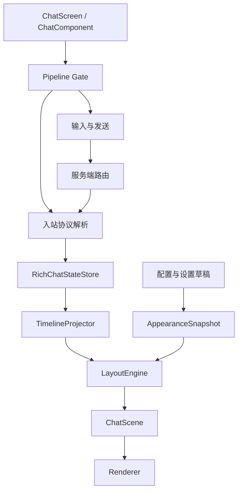

# 项目架构

## 定位

Chat Upgrade 是 Minecraft 富媒体聊天模组，支持 Fabric、NeoForge、26.1.x 和 26.2.x。功能范围包括：

- 文本、行内表情、图片、音频和视频的聊天展示。
- 文件、剪贴板和 URL 媒体发送。
- 结构化消息、附件 metadata、回复和撤回。
- 服务端媒体存储、上传和分块下发。
- 对旧客户端和 vanilla 客户端的文本降级。

## 分层



### 客户端

| 模块 | 主要职责 |
| --- | --- |
| `client/ui/chat/input` | composer、附件草稿、回复目标和发送批次。 |
| `client/ui/chat/state` | 消息事实、入站记录、撤回状态和 timeline 投影。 |
| `client/ui/chat/viewport` | 布局、滚动、媒体节点和命中框。 |
| `client/ui/chat/scene` | 不可变单帧场景和 TAKEOVER renderer。 |
| `client/ui/chat/interaction` | 手势、消息菜单和类型化动作。 |
| `client/media` | 图片、音频、视频加载与播放。 |
| `client/upload` | 第三方和服务端上传路由。 |
| `client/mixin` | 将 Minecraft 生命周期接入公共管线；不承载业务规则。 |

### 服务端与协议

| 模块 | 主要职责 |
| --- | --- |
| `net` | payload、schema 模型、编解码和协议限制。 |
| `server/ServerChatRouteService` | 校验提交、补齐可信身份/时间/消息 ID，并按能力分发。 |
| `server/ServerMediaService` | 上传会话、媒体请求和分块下发。 |
| `server/ServerAttachmentService` | 附件 metadata 写入和查询。 |
| `server/store` | 内存或磁盘媒体存储。 |

### 加载器

`src/common` 只依赖平台抽象；`src/fabric` 和 `src/neoforge` 分别实现入口、命令、网络注册和发送。`Platform.bootstrap(...)` 必须在公共逻辑读取配置目录或服务端状态之前完成。

## 两种运行模式

- `TAKEOVER`：文本和附件进入统一状态层，布局结果同时生成绘制区域和命中区域。原版 `EditBox` 仍负责文本、焦点、历史、命令建议和提交桥接。
- `COMPAT_TEXT_VANILLA`：无附件纯文本尽量使用原版输入和显示；结构化附件、bracket 和媒体增强仍走兼容入口。

兼容模式不是第二套完整聊天 UI；它的目标是减少普通文本与其它聊天模组的冲突。

## 状态与坐标不变量

```text
Ingress -> StateStore(newest-first) -> Timeline(oldest-first)
        -> Layout -> Scene -> Renderer
```

- 状态层保存消息是什么，不保存消息画在哪里。
- layout 一次生成文本、媒体、背景和 hit box 的坐标；renderer 不二次推断水平偏移。
- surface 使用 GUI 绝对坐标，消息节点使用内容局部坐标。
- scissor、pose 和 Minecraft 生命周期由 mixin 管理，业务逻辑放在普通类中。
- 配置编辑通过 baseline/draft 预览，只有保存才替换持久化配置。

## 目录与构建关系

```text
src/common/      公共实现和测试
src/fabric/      Fabric 实现
src/neoforge/    NeoForge 实现
buildSrc/        Java 源码合并与版本预处理
gradle/targets/  每个 Minecraft 目标的依赖和发布开关
```

Stonecutter 根据 `settings.gradle.kts` 注册目标。新增目标时必须同时增加 properties、依赖坐标、运行验证和本目录中的支持矩阵；不要只修改文档中的版本号。