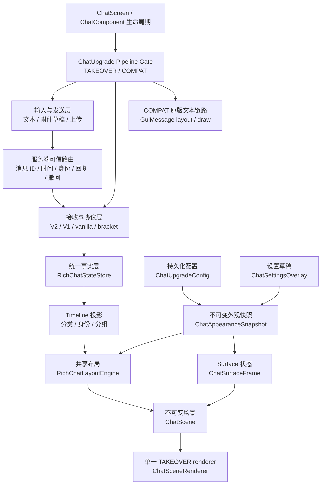
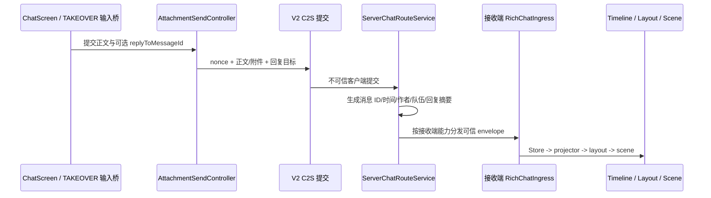
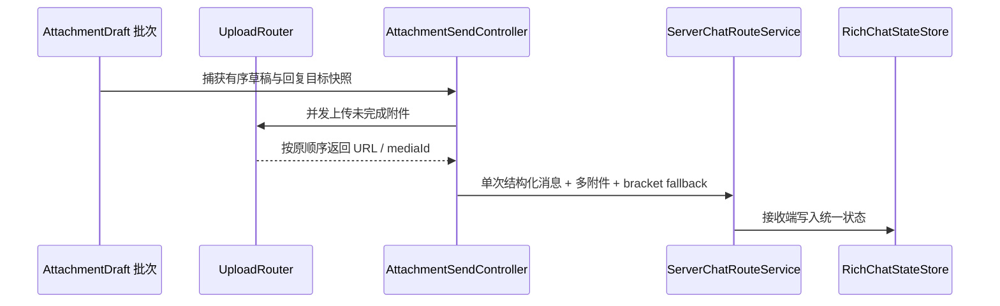

# 项目总架构

这篇文档说明 Chat Upgrade 当前的整体结构。它不按源码逐段解释，而是按模块职责、数据流和边界组织。

## 项目定位

Chat Upgrade 是 Minecraft 富媒体聊天模组，支持 **Fabric** 与 **NeoForge**，目标版本 **26.1 / 26.2**。用于把聊天消息升级为富媒体聊天：

- 普通文本仍可显示。
- 图片、音频、视频可以作为聊天附件展示。
- `[:token]` 行内表情可以解析并渲染为图片。
- 客户端可通过文件选择、剪贴板、命令等方式发送附件。
- 服务端安装模组后可以承担媒体上传、metadata 存储和多客户端分发。
- 未安装新客户端的接收方仍可以收到安全降级文本或 `[[ChatUpgrade,...]]` / `[[CICode,...]]` bracket 载荷。

## 运行模式

| 模式 | 目标 | 纯文本 | 附件 | 渲染事实来源 |
| --- | --- | --- | --- | --- |
| `TAKEOVER` | 默认拥有完整聊天 surface | 进入统一协议/状态层 | 进入统一协议/状态层 | `RichChatStateStore -> ChatTimelineProjector -> ChatScene` |
| `COMPAT_TEXT_VANILLA` | 保留原版文本兼容链路 | Minecraft 原版 `ChatComponent -> GuiMessage` | 保留隔离的富媒体兼容入口 | 原版文本布局/绘制 + 附件兼容投影 |

默认模式是 `TAKEOVER`。配置文件没有 `chatInputMode` 字段时，运行时等价于 `TAKEOVER`。只有显式配置为 `COMPAT_TEXT_VANILLA` 才进入兼容文本模式。

## 总体层级



## TAKEOVER surface 所有权

`TAKEOVER` 不再把 Minecraft 原版聊天矩形当作布局来源。`ChatSurfaceController` 维护左下锚定、可拖动、可缩放并持久化的 `ChatPanelGeometry`，根据聊天打开状态生成两种 presentation：

- `OPEN_PANEL`：完整交互面板，包含 header 与 timeline viewport；关闭“原版风格输入栏”后才包含合并 composer 区域。默认分离布局直接复用 `ChatScreen.input` 的原版 `EditBox`，并按实际输入工具区顶边限制面板最大高度。
- `CLOSED_HUD`：复用同一 surface 状态的紧凑淡出 HUD。

消息内容不以原版 `GuiMessage.Line` 为事实来源：

```text
RichChatStateStore (newest-first)
  -> ChatTimelineProjector (oldest-first)
  -> RichChatLayoutEngine (appearance snapshot)
  -> ChatScene (immutable frame)
  -> ChatSceneRenderer
```

surface 几何与 scissor 使用 GUI 绝对坐标；消息节点使用内容局部坐标。文本、媒体、消息背景和 hit box 来自同一次布局，渲染层不能再次改写水平坐标。

## 外观配置与共享场景

`ChatUpgradeConfig.appearance` 保存用户可编辑的外观数据；`ChatAppearanceSnapshot` 在帧边界把配置转换为不可变的颜色、尺寸和布局值。所有组合共用同一套 scene/layout/render 管线：

- `ChatAppearanceRuntime` 只暴露当前不可变快照，不让 renderer 读取可变配置。
- `RichChatLayoutEngine` 消费头像、双行布局、左右分栏、非玩家消息位置、气泡 padding 等会影响坐标的值。
- `ChatSurfaceFrame` 固化当前帧的外观快照；配置预览后下一帧重建必要布局，不修改消息事实、协议能力或动作语义。
- `ChatSceneRenderer`、`RichChatMediaRenderer`、`ChatComposerRenderer` 与 `ChatContextMenu` 只按布局结果和稳定 palette 绘制，不维护样式 ID 或预设注册表。

`ChatSettingsOverlay` 打开时深拷贝整份配置作为基线与草稿。每次编辑实时预览草稿；保存提交整份配置并落盘，取消、关闭或异常退出恢复基线。旧 JSON 中的 `chatTheme` 仅作为废弃字段检测并在加载后重写删除，不迁移该字段对应的旧样式。

## 类型化交互与 composer

TAKEOVER 的输入动作不再全部伪装为 Minecraft 文本 `Style`。交互数据流固定为：

```text
屏幕坐标
  -> ChatGesture（PRIMARY / SECONDARY）
  -> ChatGestureTarget（消息 + 可选叶子 hit box）
  -> ChatAction（回复 / 复制 / 撤回 / 媒体控制）
  -> Style 兼容适配或 ChatScreen 动作执行
```

`RichChatInteractionRouter` 只负责当前场景坐标与命中目标；`ChatMessageActionCatalog` 根据可信消息事实生成右键菜单项；`ChatComposerState` 并列持有附件草稿和回复目标。回复发送只走 V2 submission 的 `replyToMessageId`，不在旧协议或 bracket fallback 中静默丢失语义。异步附件上传会捕获提交时的回复目标，并只清除同一个目标，避免上传期间切换回复对象造成状态覆盖。

## COMPAT 隔离

`COMPAT_TEXT_VANILLA` 的纯文本继续走 Minecraft 原版 `ChatComponent -> GuiMessage -> 原版布局/绘制`。TAKEOVER 的 metrics、surface 坐标、布局策略和外观快照不得进入该链路。

兼容 HUD 仍可通过旧重载显示富媒体，但使用单一稳定 palette，不消费 TAKEOVER 设置中的消息布局值。

## 工程与加载器分层

项目采用 **Stonecutter 多版本编排** + **各加载器原生工具链** + **自写平台抽象**，单一 `src/common` 源码树编译到多个目标：

```text
src/
  common/     # 加载器无关逻辑 + mixin + platform 抽象
  fabric/     # Fabric 入口与平台实现
  neoforge/   # NeoForge 入口与平台实现
```

| 层级 | 包/路径 | 职责 |
| --- | --- | --- |
| 公共入口 | `src/common/.../ChatUpgrade.java` | 服务端公共初始化（配置、媒体存储） |
| 平台抽象 | `src/common/.../platform` | `Platform`、`Net`、`CommandSink` 等接口 |
| Fabric 绑定 | `src/fabric/.../fabric/*` | `ModInitializer`、Fabric 网络/命令/事件实现 |
| NeoForge 绑定 | `src/neoforge/.../neoforge/*` | `@Mod`、NeoForge payload/事件实现 |

技术 mod id 为 `chatupgrade`（NeoForge 不允许连字符）；配置目录仍为 `config/chat-upgrade/`。

## 客户端模块（common）

| 模块 | 主要路径 | 职责 |
| --- | --- | --- |
| 初始化与命令 | `src/common/.../client/ChatUpgradeClientBootstrap.java`、`ChatUpgradeCommands.java`；加载器入口见 `src/fabric`、`src/neoforge` | 客户端公共初始化、命令树、插件预热、资源清理。 |
| 配置与设置 | `src/common/.../client/ChatUpgradeConfig.java`、`ChatClientConfigRuntime.java`、`client/ui/settings` | 客户端持久化配置、范围归一化、草稿预览、整份提交与取消回滚。 |
| Composer 状态 | `src/common/.../client/ui/chat/input` | 有序多附件草稿、回复目标、剪贴板/文件来源、批次上传与快照提交控制。 |
| 聊天事实与投影 | `src/common/.../client/ui/chat/state` | 统一消息事实、撤回 tombstone、身份/分类/分组 timeline 投影。 |
| 类型化交互 | `src/common/.../client/ui/chat/interaction` | 统一手势目标、类型化动作、右键消息菜单和 Minecraft `Style` 兼容适配。 |
| Surface 与外观 | `src/common/.../client/ui/chat/surface` | presentation、面板几何、不可变 frame、外观快照与运行时应用。 |
| 高 DPI 绘制 | `src/common/.../client/ui/render` | 抗锯齿圆角 primitive、动态纹理 atlas、图标与 GUI 缩放缓存生命周期。 |
| 场景 | `src/common/.../client/ui/chat/scene` | 不可变场景组合和单一 TAKEOVER renderer。 |
| 富媒体 viewport | `src/common/.../client/ui/chat/viewport` | TAKEOVER 布局、渲染节点、命中框、滚动状态和媒体 painter。 |
| 媒体加载 | `src/common/.../client/media` | 图片、音频、视频加载和缓存。 |
| 服务端媒体客户端 | `src/common/.../client/net/servermedia` | 服务端能力、上传/查询 future、结构化消息接收。 |
| Mixin 接入 | `src/common/.../client/mixin` | ChatScreen/ChatComponent 生命周期、输入、裁切、滚动和点击适配。 |

## 服务端模块（common）

| 模块 | 主要路径 | 职责 |
| --- | --- | --- |
| 服务端入口 | `src/common/.../ChatUpgrade.java` | 公共服务端初始化；各加载器负责 payload/事件注册。 |
| 统一协议 | `src/common/.../net` | payload、结构化聊天消息、附件、wire codec。 |
| 聊天路由 | `src/common/.../server/ServerChatRouteService.java` | 根据接收端能力和模式分发 V2/V1/bracket/vanilla 消息，生成可信消息 ID、时间、作者、队伍与回复摘要，并按连接玩家 UUID 校验撤回。 |
| 媒体服务 | `src/common/.../server/ServerMediaService.java` | 媒体上传、请求、分块下发。 |
| 附件 metadata | `src/common/.../server/ServerAttachmentService.java` | 附件 metadata 提交、查询和缓存。 |
| 存储 | `src/common/.../server/store` | 内存/磁盘媒体存储。 |
| 服务端 Mixin | `src/common/.../mixin/ServerGamePacketListenerImplMixin.java` | 拦截旧聊天载荷并交给统一服务端路由。 |

## 关键数据流

### TAKEOVER 纯文本发送



### TAKEOVER 附件发送



### 兼容与 bracket 协议

`[[ChatUpgrade,...]]` 与 `[[CICode,...]]` bracket 文本仍然保留并受支持：

- 新 TAKEOVER 客户端：解析后写入统一状态层。
- 新兼容客户端：走附件兼容投影或普通原版文本链路。
- bracket 兼容客户端：收到 bracket 载荷。
- vanilla 客户端：收到安全可读文本和链接提示。

## 架构原则

- `TAKEOVER` 的事实来源是 `RichChatStateStore`，不是 `GuiMessage.Line`。
- 数据方向固定为 `Ingress -> Store(newest-first) -> TimelineProjector(oldest-first) -> LayoutEngine -> ChatScene`；渲染层不回溯推断事实。
- 外观配置只能通过 `ChatAppearanceSnapshot` 进入场景、布局和 renderer，不允许重新引入样式 ID、预设注册表或多套 renderer。
- 会改变视觉位置的策略必须在布局阶段生成 `visualBounds`、头像/元信息 bounds、节点与 hit box，避免坐标复杂度扩散。
- `ChatComponentRichViewportMixin` 保持薄适配，只处理 Minecraft 生命周期、裁切、pose 和共享场景调用。
- `COMPAT_TEXT_VANILLA` 的原版文本布局/绘制必须与 TAKEOVER metrics、坐标和外观快照隔离。
- 回复身份、撤回权限和删除事实由服务端确认；UI 不得伪造。
- composer 的有序附件批次、回复目标、右键菜单和类型化动作由独立交互模块维护；scene renderer 只消费场景与外观快照，不持有交互状态。
- 玩家消息头像优先使用 `PlayerInfo`/已加载玩家的皮肤纹理绘制头部与帽层；纹理不可用时回退到稳定色块与 glyph。命令建议、历史与命令执行继续复用原版桥接，但其可见输入与焦点由 composer surface 管理。