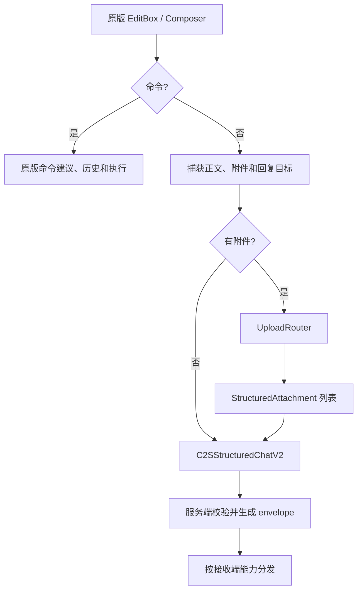

# 聊天 Pipeline 与模式边界

本文描述消息从输入到渲染的主路径。模式判断集中在 `ChatUpgradeChatPipelineGate`；Mixin 不能在运行时卸载，因此入口始终由 gate 决定是否接管。

## 模式行为

| 模式 | 纯文本 | 附件 | 主要事实来源 |
| --- | --- | --- | --- |
| `TAKEOVER` | 通过 schema 2 优先发送，接收后进入统一状态层。 | 结构化附件优先；能力不足时仅在语义允许的范围降级。 | `RichChatStateStore` |
| `COMPAT_TEXT_VANILLA` | 尽量保留原版输入和显示。 | 仍拦截附件发送，并保留结构化/bracket 富媒体显示。 | 原版文本链路 + 兼容附件投影 |

## 发送路径



发送批次在开始时捕获正文、附件和 `replyToMessageId`。上传期间新增的草稿属于下一批。命令始终优先走原版执行链路，不应被富媒体普通消息发送逻辑拦截。

## 接收路径

```text
结构化 payload / bracket / 原版文本
    -> 解析与限制校验
    -> RichChatIngress
    -> RichChatStateStore
    -> TimelineProjector
    -> RichChatLayoutEngine
    -> ChatScene / 兼容投影
```

TAKEOVER 下，结构化消息和可解析的 bracket 消息会转换为统一事实；COMPAT 下，无附件结构化纯文本不应强行进入 TAKEOVER viewport。

## 降级规则

- schema 2 是首选，承载回复、可信作者、服务端消息 ID 和撤回关联。
- schema 1 只承载旧结构化消息，不提供 schema 2 的回复和 mutation 语义。
- bracket 是文本兼容层。客户端主动降级只适用于单附件且没有回复目标的场景。
- 多附件或带回复目标的消息如果没有足够的结构化能力，应保留已上传草稿并报告失败，不得静默丢失语义。
- vanilla 客户端收到安全可读文本；已收到的旧文本无法被后续撤回同步修改。

## 接入点

| 入口 | TAKEOVER | COMPAT |
| --- | --- | --- |
| `ChatScreenRichInputMixin` | 接管普通消息和附件批次，复用原版 EditBox。 | 普通纯文本放行，附件发送接管。 |
| `ChatComponentRichViewportMixin` | 绘制统一 scene 并处理内容裁切。 | 不接管普通文本 viewport。 |
| `ChatComponentMixin` | 记录事实、解析 bracket 和表情。 | 保留原版文本与附件兼容投影。 |
| `ChatScreenSmoothScrollMixin` | 提供 TAKEOVER 像素滚动。 | 保留原版或旧增强行为。 |

## 不能破坏的边界

- 不把 `GuiMessage.Line` 或 phantom 行作为 TAKEOVER 的附件事实来源。
- 不让 COMPAT 普通纯文本消费 TAKEOVER 的 metrics、坐标或外观快照。
- 不在 legacy/bracket 降级中静默丢弃回复、多附件或撤回语义。
- 不绕过 `StructuredChatProtocolLimits` 和 `canSend(...)` 能力判断。