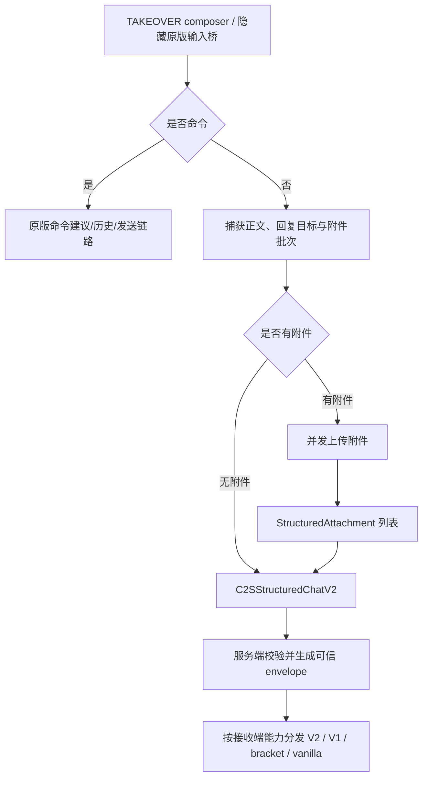
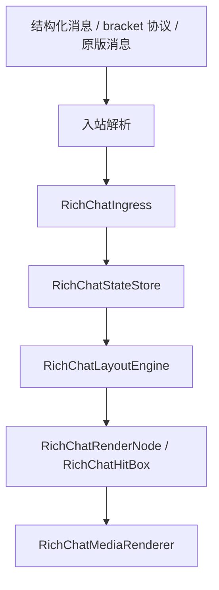

# 聊天 Pipeline 与模式边界

这篇文档说明聊天消息从输入、发送、服务端路由、客户端接收，到最终渲染的完整流转。重点是 `TAKEOVER` 与 `COMPAT_TEXT_VANILLA` 的职责分离。

## 模式总览

| 模式 | 定位 | 无附件纯文本 | 有附件消息 | 渲染策略 |
| --- | --- | --- | --- | --- |
| `TAKEOVER` | 默认完整接管 | V2 结构化发送，接收后进入统一状态层 | V2 优先；无回复可退到 V1；仅单附件无回复可最终 bracket fallback | 完整 `ChatSurfaceController` / `ChatScene` 自定义 surface |
| `COMPAT_TEXT_VANILLA` | 兼容其它聊天类模组 | 尽量放回原版输入/显示链路 | 仍拦截并走富媒体路径 | 原版文本 + 富媒体兼容投影 |

模式判断集中在 `ChatUpgradeChatPipelineGate`。运行时不能动态禁用 mixin，因此所有入口都通过 gate 在方法内部决定是否接管。

## TAKEOVER 的职责

`TAKEOVER` 是完整富媒体聊天模型：

- 纯文本也进入统一协议/状态层。
- 附件消息优先走结构化协议。
- bracket 协议 `[[ChatUpgrade,...]]` / `[[CICode,...]]` 作为标准文本兼容层；客户端主动 fallback 仅允许单附件且无回复，服务端仍可按接收端能力重建安全降级文本。
- 渲染事实来源是 `RichChatStateStore`。
- 原版 `ChatScreen` 只保留打开/关闭、焦点、命令建议、历史与发送桥接；可见面板、timeline、composer、菜单、弹层、滚动条和调整手柄由 TAKEOVER surface 接管。
- 文本、表情、图片、音频、视频都作为 timeline 节点处理。
- 滚动、裁切、hover、click、tooltip 和 pointer capture 都由统一交互层处理。
- 消息右键菜单与 hover 动作条共享类型化目录，按消息事实提供回复、复制、提及、资料、本地隐藏、屏蔽/取消屏蔽、本人撤回和可配置的调试信息。

### TAKEOVER 输入流



关键边界：命令输入保持原版执行链路。普通消息优先提交 V2；无回复时允许 V1 结构化兼容，只有单附件且无回复目标时才允许最终退到 bracket 文本，避免静默丢失回复或多附件语义。

### TAKEOVER 接收流



`TAKEOVER` 下旧 phantom 行不会作为媒体承载主路径。旧 phantom/HUD 仅保留在兼容或 fallback 分支。

## COMPAT_TEXT_VANILLA 的职责

兼容模式的目标是降低与其它聊天显示/文本处理类模组冲突。

它的行为是：

- 无附件纯文本尽量放行原版输入链路。
- 无附件纯文本尽量保持原版显示效果。
- 普通文本不触发 TAKEOVER 级 viewport、emoji、phantom、滚动增强等高风险入口。
- 有附件草稿时仍拦截回车发送。
- 收到结构化附件或 bracket 协议文本时仍显示富媒体。
- 收到结构化纯文本时普通显示，不进入富媒体投影。

兼容模式不是第二套 TAKEOVER，它只保留“附件增强”和“bracket 协议兼容”。

## bracket 协议的位置

bracket 载荷格式类似：

```text
[[ChatUpgrade,url=...,name=...,type=image]]
[[CICode,url=...]]
```

现在它有三个作用：

1. `[[ChatUpgrade,...]]` 作为 Chat Upgrade 标准 bracket tag。
2. `[[CICode,...]]` 作为受支持的图片兼容 tag。
3. 服务端按接收端能力重建降级内容，或客户端在“单附件且无回复”的最终 fallback 边界发送 bracket；手动命令和历史消息继续可解析。

但在 TAKEOVER 下，它不会成为长期事实来源。解析后会转换为 `RichAttachment` 并写入统一状态层。

## 服务端路由后的接收差异

| 接收端 | 纯文本 | 附件消息 |
| --- | --- | --- |
| 新 TAKEOVER 客户端 | `S2CStructuredChatV2` | `S2CStructuredChatV2`，包含完整附件与回复语义 |
| 新 COMPAT 客户端 | 普通文本显示 | 结构化附件或 bracket fallback |
| bracket 兼容客户端 | bracket 文本 | bracket 文本 |
| vanilla 客户端 | 安全文本 | 可读占位 + 链接提示 |

服务端不直接相信客户端传入的 fallback 附件文本；结构化附件会由服务端重建 bracket 降级文本。

## Mixin 接入点

| 入口 | TAKEOVER | COMPAT |
| --- | --- | --- |
| `ChatScreenRichInputMixin` | 接管可见 composer、普通消息、附件批次、表情弹层和命令桥接 | 普通文本放行，附件接管 |
| `ChatComponentRichViewportMixin` | 接管完整 surface 的场景绘制与 timeline 裁切 | 不接管 |
| `ChatComponentMixin` | 普通消息补写 facts，清理 phantom pending | bracket/附件投影兼容 |
| `ChatScreenSmoothScrollMixin` | viewport 像素滚动 | 原版/旧增强 |
| `ChatScreenScrollbarDragMixin` | viewport 滚动条拖拽 | 原版/旧增强 |
| `ChatScreenImageClickMixin` | viewport hit box 优先 | 旧 inline 点击兜底 |

## 不变量

- `TAKEOVER` 下不要重新依赖 `GuiMessage.Line` 保存附件事实。
- `TAKEOVER` 下不要把 phantom 行作为布局事实。
- `COMPAT_TEXT_VANILLA` 下不要让普通纯文本进入 TAKEOVER 高风险渲染链路。
- 命令输入始终优先保留原版链路。
- bracket 协议必须继续能解析和降级。