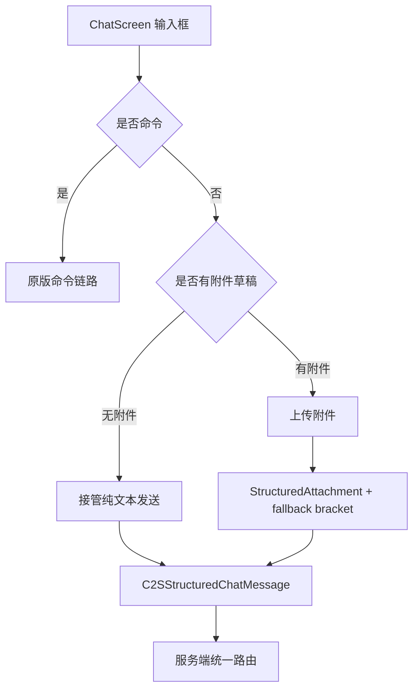
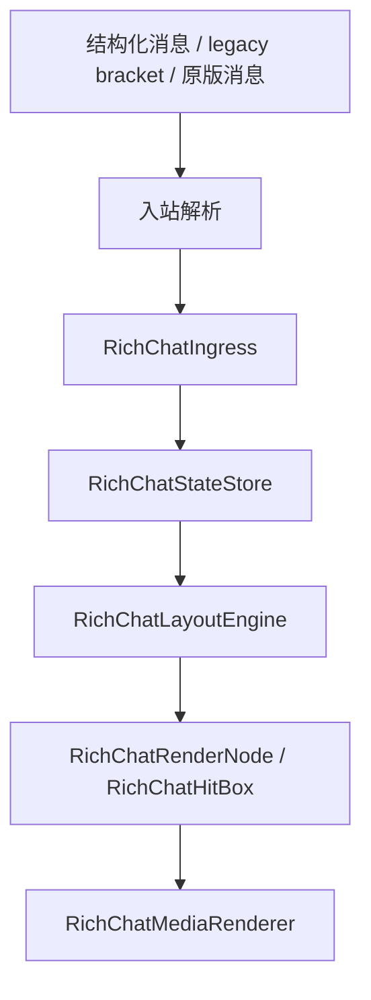

# 聊天 Pipeline 与模式边界

这篇文档说明聊天消息从输入、发送、服务端路由、客户端接收，到最终渲染的完整流转。重点是 `TAKEOVER` 与 `COMPAT_TEXT_VANILLA` 的职责分离。

## 模式总览

| 模式 | 定位 | 无附件纯文本 | 有附件消息 | 渲染策略 |
| --- | --- | --- | --- | --- |
| `TAKEOVER` | 默认完整接管 | 结构化发送，接收后进入统一状态层 | 结构化附件优先，legacy bracket 兜底 | `RichChatViewport` 自定义渲染 |
| `COMPAT_TEXT_VANILLA` | 兼容其它聊天类模组 | 尽量放回原版输入/显示链路 | 仍拦截并走富媒体路径 | 原版文本 + 富媒体兼容投影 |

模式判断集中在 `ChatUpgradeChatPipelineGate`。运行时不能动态禁用 mixin，因此所有入口都通过 gate 在方法内部决定是否接管。

## TAKEOVER 的职责

`TAKEOVER` 是完整富媒体聊天模型：

- 纯文本也进入统一协议/状态层。
- 附件消息优先走结构化协议。
- 旧 `[[ChatUpgrade,...]]` 只作为输入兼容和服务端降级兜底。
- 渲染事实来源是 `RichChatStateStore`。
- 聊天栏内容区由 `RichChatViewport` 绘制。
- 文本、表情、图片、音频、视频都作为 viewport 节点处理。
- 滚动、裁切、hover、click、tooltip 都由 viewport 交互层处理。

### TAKEOVER 输入流



关键边界：命令输入保持原版链路。`TAKEOVER` 接管的是普通聊天消息，不接管命令执行。

### TAKEOVER 接收流



`TAKEOVER` 下旧 phantom 行不会作为媒体承载主路径。旧 phantom/HUD 仅保留在兼容或 fallback 分支。

## COMPAT_TEXT_VANILLA 的职责

兼容模式的目标是降低与其它聊天显示/文本处理类模组冲突。

它的行为是：

- 无附件纯文本尽量放行原版输入链路。
- 无附件纯文本尽量保持原版显示效果。
- 普通文本不触发 TAKEOVER 级 viewport、emoji、phantom、滚动增强等高风险入口。
- 有附件草稿时仍拦截回车发送。
- 收到结构化附件或旧 bracket 时仍显示富媒体。
- 收到结构化纯文本时普通显示，不进入富媒体投影。

兼容模式不是第二套 TAKEOVER，它只保留“附件增强”和“旧协议兜底”。

## legacy bracket 的位置

旧载荷格式类似：

```text
[[ChatUpgrade,url=...,name=...,type=image]]
[[CICode,url=...]]
```

现在它有三个作用：

1. 旧客户端兼容。
2. 服务端或接收端不支持结构化协议时降级。
3. 手动命令或历史消息继续可解析。

但在 TAKEOVER 下，它不会成为长期事实来源。解析后会转换为 `RichAttachment` 并写入统一状态层。

## 服务端路由后的接收差异

| 接收端 | 纯文本 | 附件消息 |
| --- | --- | --- |
| 新 TAKEOVER 客户端 | `S2CStructuredChatMessage` | `S2CStructuredChatMessage`，包含附件 |
| 新 COMPAT 客户端 | 普通文本显示 | 结构化附件或 legacy fallback |
| 旧模组客户端 | legacy bracket 文本 | legacy bracket 文本 |
| vanilla 客户端 | 安全文本 | 可读占位 + 链接提示 |

服务端不直接相信客户端传入的 fallback 附件文本；结构化附件会由服务端重建 legacy bracket 降级文本。

## Mixin 接入点

| 入口 | TAKEOVER | COMPAT |
| --- | --- | --- |
| `ChatScreenRichInputMixin` | 接管普通聊天和附件发送 | 普通文本放行，附件接管 |
| `ChatComponentRichViewportMixin` | 接管聊天内容区渲染 | 不接管 |
| `ChatComponentMixin` | 普通消息补写 facts，清理 phantom pending | legacy/附件投影兼容 |
| `ChatScreenSmoothScrollMixin` | viewport 像素滚动 | 原版/旧增强 |
| `ChatScreenScrollbarDragMixin` | viewport 滚动条拖拽 | 原版/旧增强 |
| `ChatScreenImageClickMixin` | viewport hit box 优先 | 旧 inline 点击兜底 |

## 不变量

- `TAKEOVER` 下不要重新依赖 `GuiMessage.Line` 保存附件事实。
- `TAKEOVER` 下不要把 phantom 行作为布局事实。
- `COMPAT_TEXT_VANILLA` 下不要让普通纯文本进入 TAKEOVER 高风险渲染链路。
- 命令输入始终优先保留原版链路。
- legacy bracket 必须继续能解析和降级。