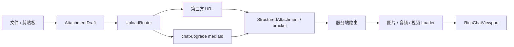

# 媒体上传与资源加载

## 总体流程



`send`、`sendaudio`、`sendvideo` 的 URL 命令不上传文件，直接创建附件引用；本地文件和剪贴板内容才进入上传路由。

## 附件草稿与发送批次

核心类：

- `AttachmentDraft`
- `ChatComposerState`
- `AttachmentDraftResolver`
- `AttachmentSendController`

composer 最多保留 8 个有序附件。文件选择器、剪贴板和上传命令可追加草稿，chip 可单独删除，也可清空全部草稿。每个草稿至少有可发送、上传中、已上传和失败状态。

发送时创建不可变批次快照：

1. 捕获当前正文、附件顺序和回复目标。
2. 并发上传未完成附件。
3. 等待整批结果并按原顺序生成 `StructuredAttachment`。
4. 发送一条结构化消息。
5. 只清理属于该批次的草稿和回复目标。

上传期间新增内容不会被误清除。上传失败时保留成功项和失败项，用户处理失败项后可继续发送。

## 上传路由

核心类：`UploadRouter`、`ServerUploadProvider`、`ThirdPartyUploadProvider`、`CatboxUploader`。

| 模式 | 行为 |
| --- | --- |
| `AUTO` | 服务端能力可用时使用服务端，否则使用第三方。已选定提供方后失败不自动切换。 |
| `SERVER` | 强制服务端；能力不可用或上传失败直接报错。 |
| `THIRD_PARTY` | 强制第三方。当前第三方实现使用 Litterbox API，默认保留 1 小时。 |

结构化消息和 bracket fallback 会同时准备。只有单附件且没有回复目标时，结构化能力不足才允许最终发送 bracket；多附件或带回复目标必须保留完整结构化语义。

## 服务端媒体

服务端配置：`config/chat-upgrade/server-media.json`。核心类：`ServerMediaService`、`ServerMediaServerNetworking`、`MediaStore`、`InMemoryMediaStore`、`DiskMediaStore`。

服务端上传成功后使用内部引用：

```text
chat-upgrade://media/<type>/<mediaId>
```

接收端不会把它当作外部 URL，而是通过 `C2SRequestMedia` 请求元信息对应的媒体字节，服务端以初始化包和分块包返回。服务端在初始化、分块、总容量、TTL、并发和速率层面校验请求。

`MEMORY` 适合临时运行；`DISK` 使用 `diskFolderName` 持久化媒体。TTL 清理和断线清理不能依赖客户端主动通知。

## metadata

`ServerAttachmentService` 保存附件 ID、媒体 ID、类型、显示名和 fallback URL 的关联。metadata 查询用于结构化接收、缓存和服务端引用解析；查询失败不应阻断已经选定的消息路由或安全降级。

## 图片

图片加载由 `ImageLoader` 和对应 decoder 完成，代码覆盖静态与动画图片，并通过 ImageIO 扩展支持 WebP 等格式。当前资源类型包括：

```text
png / apng / jpg / jpeg / gif / webp / bmp / tif / tiff / jfif / ico
```

图片加载、失败、缓存失效都会通知 viewport 刷新。`manualImageReveal=true` 时，图片在用户操作后才开始加载。

## 音频与视频

音频核心类：`AudioLoader`、`AudioEntry`、`AudioPlayerService`。视频核心类：`VideoLoader`、`VideoEntry`、`VideoPlayerService`。

- 音频：播放/暂停、循环、进度、seek、打开 URL 和浮窗。
- 视频：缩略预览、播放/暂停、进度、seek 和预览界面。
- 解码能力取决于 JavaCPP FFmpeg；音频输出使用 OpenAL。
- `manualAudioReveal` 和 `manualVideoReveal` 控制是否在用户操作后加载。

## 插件与安全

`FfmpegNativeBootstrap` 按当前平台准备 FFmpeg native；`ExternalImageIoPluginLoader` 准备 APNG 插件。外部插件下载有大小和完整性校验，运行时目录为 `config/chat-upgrade/libs/`。插件不可用时只禁用对应媒体能力，不应让普通文本聊天崩溃。

客户端接收上限、服务端单文件上限和协议 URL 长度限制必须同时生效。不要为了显示媒体而绕过 URL 校验或大小限制。

## 生命周期清理

客户端停止或断开连接时清理图片纹理、音频和视频播放状态、服务端媒体请求、表情 pending 状态和浮窗。窗口尺寸或 GUI 缩放变化会使依赖显示密度的缓存失效。新增媒体缓存时必须加入同一清理入口。