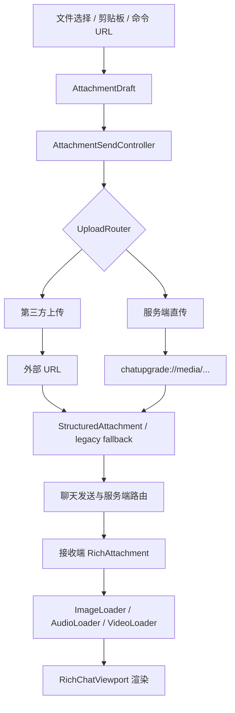

# 媒体上传与资源加载

这篇文档说明图片、音频、视频从本地输入到聊天渲染的完整链路。

## 总览



## 附件草稿

主要文件：

- `src/common/src/main/java/com/chat/upgrade/client/ui/chat/input/AttachmentDraft.java`
- `src/common/src/main/java/com/chat/upgrade/client/ui/chat/input/AttachmentComposerState.java`
- `src/common/src/main/java/com/chat/upgrade/client/ui/chat/input/AttachmentDraftResolver.java`
- `src/common/src/main/java/com/chat/upgrade/client/ui/chat/input/AttachmentSendController.java`
- `src/common/src/main/java/com/chat/upgrade/client/mixin/ChatScreenRichInputMixin.java`

当前聊天框 MVP 支持单附件草稿。

草稿来源：

- 文件选择器。
- 剪贴板文件。
- 剪贴板图片。
- 客户端命令上传。

草稿状态：

| 状态 | 含义 |
| --- | --- |
| 可发送 | 已有本地数据，等待上传。 |
| 上传中 | 正在走 `UploadRouter`。 |
| 已上传 | 已拿到 URL，可发送。 |
| 失败 | 上传或校验失败，需要展示失败状态。 |

有附件草稿时，回车由模组接管。无附件纯文本在 `TAKEOVER` 下也接管发送，在 `COMPAT_TEXT_VANILLA` 下尽量放回原版。

## 上传路由

主要文件：

- `src/common/src/main/java/com/chat/upgrade/client/upload/UploadRouter.java`
- `src/common/src/main/java/com/chat/upgrade/client/upload/ServerUploadProvider.java`
- `src/common/src/main/java/com/chat/upgrade/client/upload/ThirdPartyUploadProvider.java`
- `src/common/src/main/java/com/chat/upgrade/client/upload/CatboxUploader.java`

上传模式：

| 模式 | 行为 |
| --- | --- |
| `AUTO` | 服务端声明可用时优先服务端直传，否则第三方。 |
| `SERVER` | 强制服务端直传。 |
| `THIRD_PARTY` | 强制第三方上传。 |

发送附件时会同时准备结构化附件和旧 bracket fallback。结构化路径失败时，仍可降级旧文本载荷。

## 服务端直传媒体

主要文件：

- `src/common/src/main/java/com/chat/upgrade/server/ServerMediaServerNetworking.java`
- `src/common/src/main/java/com/chat/upgrade/server/ServerMediaService.java`
- `src/common/src/main/java/com/chat/upgrade/server/ServerMediaServerConfig.java`
- `src/common/src/main/java/com/chat/upgrade/server/store/MediaStore.java`
- `src/common/src/main/java/com/chat/upgrade/server/store/InMemoryMediaStore.java`
- `src/common/src/main/java/com/chat/upgrade/server/store/DiskMediaStore.java`

服务端安装并启用后，客户端可以上传媒体到服务器。上传成功后，聊天中的 URL 会变成：

```text
chatupgrade://media/<mediaId>?t=<type>
```

接收端看到该 URL 后，通过服务端 payload 请求媒体字节并渲染。

服务端媒体配置项：

| 字段 | 含义 |
| --- | --- |
| `enabled` | 是否启用服务端上传和下发。 |
| `storageMode` | `MEMORY` 或 `DISK`。 |
| `diskFolderName` | 磁盘存储目录名。 |
| `maxSingleBytes` | 单个媒体大小上限。 |
| `maxChunkBytes` | 分块大小。 |
| `maxTotalBytes` | 总容量上限。 |
| `ttlSeconds` | 过期时间，`0` 表示不过期。 |

## 附件 metadata

主要文件：

- `src/common/src/main/java/com/chat/upgrade/server/ServerAttachmentService.java`
- `src/common/src/main/java/com/chat/upgrade/server/store/StoredAttachment.java`
- `src/common/src/main/java/com/chat/upgrade/client/net/servermedia/ServerMediaClient.java`

metadata 用于把附件 ID、媒体 ID、类型、显示名、fallback URL 关联起来。

它的作用：

- 结构化聊天协议的基础。
- `chatupgrade://media/...` 可以反查附件信息。
- 新客户端接收结构化消息时可以缓存附件信息。
- 旧文本解析时可以优先使用已缓存 metadata。

当前限制：metadata 查询结果不会自动回写已经生成的历史聊天行；如果未来需要，需要状态层支持更新和重投影。

## 图片加载

主要文件：

- `src/common/src/main/java/com/chat/upgrade/client/media/image/ImageLoader.java`
- `src/common/src/main/java/com/chat/upgrade/client/media/image/ImageEntry.java`
- `src/common/src/main/java/com/chat/upgrade/client/media/image/RasterImageDecoder.java`
- `src/common/src/main/java/com/chat/upgrade/client/media/image/GifAnimatedDecoder.java`
- `src/common/src/main/java/com/chat/upgrade/client/media/image/ApngAnimatedDecoder.java`
- `src/common/src/main/java/com/chat/upgrade/client/media/image/WebpAnimatedDecoder.java`

支持格式包括：

```text
png / apng / jpg / jpeg / gif / webp / bmp / tif / tiff / jfif / ico
```

图片加载成功、失败、缓存清理都会通知 `RichChatViewport` 失效刷新。`TAKEOVER` 下刷新主目标是 viewport；旧 phantom HUD 通知只保留在兼容辅助路径。

## 音频加载与播放

主要文件：

- `src/common/src/main/java/com/chat/upgrade/client/media/audio/AudioLoader.java`
- `src/common/src/main/java/com/chat/upgrade/client/media/audio/AudioEntry.java`
- `src/common/src/main/java/com/chat/upgrade/client/media/audio/AudioPlayerService.java`
- `src/common/src/main/java/com/chat/upgrade/client/ui/layout/AudioUiLayout.java`

支持常见音频容器和编码，实际解码能力取决于 FFmpeg。

音频 UI 支持：

- 播放/暂停。
- 循环。
- 打开 URL。
- 浮窗。
- 进度展示和 seek。

## 视频加载与播放

主要文件：

- `src/common/src/main/java/com/chat/upgrade/client/media/video/VideoLoader.java`
- `src/common/src/main/java/com/chat/upgrade/client/media/video/VideoEntry.java`
- `src/common/src/main/java/com/chat/upgrade/client/media/video/VideoPlayerService.java`
- `src/common/src/main/java/com/chat/upgrade/client/ui/layout/VideoUiLayout.java`

视频 UI 支持：

- 缩略预览。
- 播放/暂停。
- 进度条。
- seek。
- 打开预览界面。

视频和音频都依赖 JavaCPP FFmpeg 解码，音频播放基于 OpenAL。

## 插件与 native

主要文件：

- `src/common/src/main/java/com/chat/upgrade/client/plugin/FfmpegNativeBootstrap.java`
- `src/common/src/main/java/com/chat/upgrade/client/plugin/ExternalImageIoPluginLoader.java`

运行时会尝试准备：

- FFmpeg JavaCPP native。
- imageio-apng 插件。

失败时不应导致整个模组崩溃，但对应格式或视频/音频能力会受影响，并通过日志和命令状态反馈。

## 手动触发渲染

配置项：

| 字段 | 说明 |
| --- | --- |
| `manualImageReveal` | 图片点击后才加载。 |
| `manualAudioReveal` | 音频点击后才加载。 |
| `manualVideoReveal` | 视频点击后才加载。 |

这些开关适合控制网络请求和资源占用。

## 资源清理

断开连接或客户端停止时会清理：

- 图片纹理缓存。
- 音频缓存和播放状态。
- 视频缓存和播放状态。
- 服务端媒体 runtime 状态。
- 表情 runtime 状态。
- 浮窗状态。

窗口尺寸、GUI 缩放、帧缓冲尺寸变化时，也会触发图片和视频缓存失效，以保证高清渲染匹配当前显示密度。