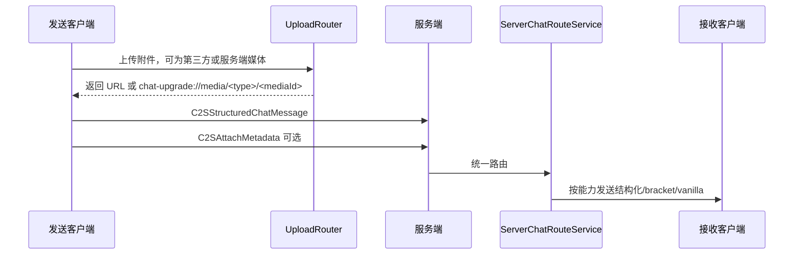

# 协议与服务端路由

这篇文档说明客户端、服务端、标准 bracket 协议和 vanilla 客户端之间如何互通。

## 协议目标

当前协议同时满足三件事：

1. 新客户端可以发送和接收结构化聊天消息。
2. 服务端可以保存和查询附件 metadata，并下发媒体字节。
3. 不支持结构化消息的模组客户端和 vanilla 客户端仍能收到可读降级内容。

## 核心模型

主要文件：

- `src/common/src/main/java/com/chat/upgrade/net/StructuredChatMessage.java`
- `src/common/src/main/java/com/chat/upgrade/net/StructuredChatSegment.java`
- `src/common/src/main/java/com/chat/upgrade/net/StructuredAttachment.java`
- `src/common/src/main/java/com/chat/upgrade/net/StructuredChatWireCodec.java`
- `src/common/src/main/java/com/chat/upgrade/net/ServerMediaPayloads.java`

### StructuredChatMessage

结构化聊天消息包含：

| 字段 | 含义 |
| --- | --- |
| `schemaVersion` | 协议版本。 |
| `clientNonce` | 客户端生成的消息 ID/去重标识。 |
| `senderName` | 服务端路由时写入的发送者。 |
| `plainText` | 纯文本部分。 |
| `segments` | 文本/附件等结构化片段。 |
| `attachments` | 附件 metadata。 |
| `fallbackText` | 降级文本。 |
| `compatFlags` | 兼容标记。 |

### StructuredAttachment

结构化附件描述图片、音频、视频等资源。它可以指向：

- 外部 URL。
- 服务端媒体 ID：`chat-upgrade://media/<type>/<mediaId>`。
- 附件 ID：用于 metadata 查询和缓存。

## Payload 分类

### 聊天输入与结构化消息

| Payload | 方向 | 说明 |
| --- | --- | --- |
| `C2SChatInputMode` | 客户端 -> 服务端 | 上报当前聊天输入模式。 |
| `C2SStructuredChatMessage` | 客户端 -> 服务端 | 发送结构化聊天消息。 |
| `S2CStructuredChatMessage` | 服务端 -> 客户端 | 下发结构化聊天消息。 |
| `S2CStructuredChatAttachment` | 服务端 -> 客户端 | 下发结构化附件兼容包。 |

### 附件 metadata

| Payload | 方向 | 说明 |
| --- | --- | --- |
| `C2SAttachMetadata` | 客户端 -> 服务端 | 提交附件 metadata。 |
| `C2SRequestAttachmentMeta` | 客户端 -> 服务端 | 查询附件 metadata。 |
| `S2CAttachmentAck` | 服务端 -> 客户端 | metadata 提交成功。 |
| `S2CAttachmentMeta` | 服务端 -> 客户端 | metadata 查询结果。 |
| `S2CAttachmentError` | 服务端 -> 客户端 | metadata 提交/查询失败。 |
| `S2CAttachmentCapability` | 服务端 -> 客户端 | metadata 能力声明。 |

### 服务端媒体上传/下发

| Payload | 方向 | 说明 |
| --- | --- | --- |
| `S2CCapability` | 服务端 -> 客户端 | 服务端媒体上传能力。 |
| `C2SUploadInit` | 客户端 -> 服务端 | 上传初始化。 |
| `C2SUploadChunk` | 客户端 -> 服务端 | 上传分块。 |
| `S2CUploadAck` | 服务端 -> 客户端 | 上传成功，返回特殊 URL。 |
| `C2SRequestMedia` | 客户端 -> 服务端 | 请求媒体字节。 |
| `S2CMediaInit` | 服务端 -> 客户端 | 媒体下发初始化。 |
| `S2CMediaChunk` | 服务端 -> 客户端 | 媒体字节分块。 |
| `S2CMediaError` | 服务端 -> 客户端 | 媒体错误。 |

## 发送链路



如果服务端不支持结构化消息，客户端会降级发送 bracket 文本。附件 metadata 提交失败不会阻断 bracket fallback。

## 服务端路由策略

主要文件：

- `src/common/src/main/java/com/chat/upgrade/server/ServerChatRouteService.java`
- `src/common/src/main/java/com/chat/upgrade/server/ServerMediaServerNetworking.java`
- `src/common/src/main/java/com/chat/upgrade/mixin/ServerGamePacketListenerImplMixin.java`

服务端会按接收端能力选择路线：

| 路线 | 条件 | 结果 |
| --- | --- | --- |
| 结构化消息 | 可发送 `S2CStructuredChatMessage`，且不是 COMPAT 纯文本保护 | 下发完整结构化消息。 |
| 结构化附件 | 可发送 `S2CStructuredChatAttachment`，且有附件 | 下发结构化附件兼容包。 |
| bracket 兼容客户端 | 可发送基础 capability，但不支持新结构化消息 | 下发标准 bracket 文本。 |
| vanilla | 不支持本模组 payload | 下发安全可读文本。 |

兼容模式客户端收到无附件纯文本时，服务端避免向它下发结构化纯文本包，让它尽量保留原版纯文本显示链路。

## 标准 bracket 协议与 fallback

bracket 协议是保留并受支持的文本协议层：

```text
[[ChatUpgrade,url=...,name=...,type=image]]
[[CICode,url=...]]
```

规则：

- `[[ChatUpgrade,...]]` 是 Chat Upgrade 的标准 bracket tag。
- `[[CICode,...]]` 是受支持的图片兼容 tag，可由 `ciCompatibility` 选择用于图片发送。
- 新 TAKEOVER 客户端解析后写入统一状态层。
- 新 COMPAT 客户端用于附件富媒体兼容显示。
- 不支持结构化消息的 bracket 兼容客户端继续显示媒体。
- vanilla 客户端收到安全占位和链接提示。

结构化附件降级时，服务端会根据 `StructuredAttachment` 重建 bracket payload，避免只信任客户端传来的 fallback 字符串。

## 客户端接收

主要文件：

- `src/common/src/main/java/com/chat/upgrade/client/net/servermedia/ServerMediaNetworking.java`
- `src/common/src/main/java/com/chat/upgrade/client/ui/chat/state/RichChatIngress.java`
- `src/common/src/main/java/com/chat/upgrade/client/ui/chat/UpgradeBracketCodec.java`

TAKEOVER 下，结构化消息接收后会：

1. 缓存附件 metadata。
2. 转成 `RichAttachment`。
3. 解码行内表情。
4. 写入 `RichChatStateStore`。
5. 预加载媒体。
6. 由 viewport 渲染。

COMPAT 下，无附件结构化纯文本会普通显示；附件仍进入富媒体兼容路径。

## 能力与安全边界

- 所有自定义 payload 发送前尽量使用 `canSend(...)` gate。
- 服务端按每个接收端能力分发，不假设所有客户端都支持最新协议。
- 服务端媒体有单文件、分块、总容量和 TTL 限制。
- 客户端接收大小受 `maxReceiveBytes` 限制。
- `chat-upgrade://media/<type>/<mediaId>` 只表示服务端媒体引用，不等同于外部 URL。
