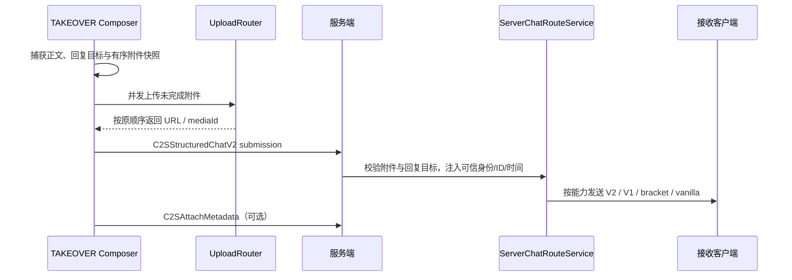

# 协议与服务端路由

这篇文档说明客户端、服务端、标准 bracket 协议和 vanilla 客户端之间如何互通。

## 协议目标

当前协议同时满足三件事：

1. 新客户端可以发送和接收结构化聊天消息。
2. 服务端可以保存和查询附件 metadata，并下发媒体字节。
3. 不支持结构化消息的模组客户端和 vanilla 客户端仍能收到可读降级内容。

## 核心模型

主要文件：

- `src/common/src/main/java/com/chat/upgrade/net/StructuredChatMessage.java`
- `src/common/src/main/java/com/chat/upgrade/net/StructuredChatSubmission.java`
- `src/common/src/main/java/com/chat/upgrade/net/StructuredChatEnvelope.java`
- `src/common/src/main/java/com/chat/upgrade/net/StructuredChatAuthor.java`
- `src/common/src/main/java/com/chat/upgrade/net/StructuredReplySummary.java`
- `src/common/src/main/java/com/chat/upgrade/net/StructuredChatMutation.java`
- `src/common/src/main/java/com/chat/upgrade/net/StructuredChatSegment.java`
- `src/common/src/main/java/com/chat/upgrade/net/StructuredAttachment.java`
- `src/common/src/main/java/com/chat/upgrade/net/StructuredChatWireCodec.java`
- `src/common/src/main/java/com/chat/upgrade/net/ServerMediaPayloads.java`

### Submission、Envelope 与旧消息模型

结构化聊天把不可信客户端提交和服务端可信广播分成两个模型，并保留 schema 1 兼容模型：

| 模型 | 方向与职责 | 关键字段 |
| --- | --- | --- |
| `StructuredChatSubmission`（schema 2） | 客户端提交；服务端不得信任其中的作者、消息 ID 或时间。 | `clientNonce`、`plainText`、`segments`、`attachments`、`replyToMessageId`。 |
| `StructuredChatEnvelope`（schema 2） | 服务端校验后广播的可信消息。 | `messageId`、`serverTimestampMs`、`author`、`kind`、正文/附件、`replyTo`、fallback 标记。 |
| `StructuredChatMessage`（schema 1） | 旧结构化客户端兼容模型，不承载回复目标或后续撤回语义。 | `clientNonce`、`senderName`、正文/附件、`fallbackText`、`compatFlags`。 |

`StructuredChatAuthor` 由服务端根据连接玩家写入 UUID、显示名和队伍快照；`StructuredReplySummary` 由服务端根据近期可信消息解析。撤回通过独立的 `StructuredChatMutation` 广播，不修改旧 schema 1 消息结构。

### StructuredAttachment

结构化附件描述图片、音频、视频等资源。它可以指向：

- 外部 URL。
- 服务端媒体 ID：`chat-upgrade://media/<type>/<mediaId>`。
- 附件 ID：用于 metadata 查询和缓存。

## Payload 分类

### 聊天输入与结构化消息

| Payload | 方向 | 说明 |
| --- | --- | --- |
| `C2SChatInputMode` | 客户端 -> 服务端 | 上报当前聊天输入模式。 |
| `C2SStructuredChatV2` | 客户端 -> 服务端 | 提交 schema 2 正文、附件和可选回复目标；不包含可信作者字段。 |
| `C2SRetractChatMessage` | 客户端 -> 服务端 | 请求撤回指定服务端消息 ID；服务端校验请求玩家 UUID。 |
| `S2CStructuredChatV2` | 服务端 -> 客户端 | 下发带可信消息 ID、时间、作者、队伍与回复摘要的 envelope。 |
| `S2CChatMutation` | 服务端 -> 客户端 | 下发撤回等消息状态变更。 |
| `C2SStructuredChatMessage` / `S2CStructuredChatMessage` | 双向兼容 | schema 1 结构化消息，不承载回复与 mutation 语义。 |
| `S2CStructuredChatAttachment` | 服务端 -> 客户端 | 下发结构化附件兼容包。 |

### 附件 metadata

| Payload | 方向 | 说明 |
| --- | --- | --- |
| `C2SAttachMetadata` | 客户端 -> 服务端 | 提交附件 metadata。 |
| `C2SRequestAttachmentMeta` | 客户端 -> 服务端 | 查询附件 metadata。 |
| `S2CAttachmentAck` | 服务端 -> 客户端 | metadata 提交成功。 |
| `S2CAttachmentMeta` | 服务端 -> 客户端 | metadata 查询结果。 |
| `S2CAttachmentError` | 服务端 -> 客户端 | metadata 提交/查询失败。 |
| `S2CAttachmentCapability` | 服务端 -> 客户端 | metadata 能力声明。 |

### 服务端媒体上传/下发

| Payload | 方向 | 说明 |
| --- | --- | --- |
| `S2CCapability` | 服务端 -> 客户端 | 服务端媒体上传能力。 |
| `C2SUploadInit` | 客户端 -> 服务端 | 上传初始化。 |
| `C2SUploadChunk` | 客户端 -> 服务端 | 上传分块。 |
| `S2CUploadAck` | 服务端 -> 客户端 | 上传成功，返回特殊 URL。 |
| `C2SRequestMedia` | 客户端 -> 服务端 | 请求媒体字节。 |
| `S2CMediaInit` | 服务端 -> 客户端 | 媒体下发初始化。 |
| `S2CMediaChunk` | 服务端 -> 客户端 | 媒体字节分块。 |
| `S2CMediaError` | 服务端 -> 客户端 | 媒体错误。 |

## 发送链路



普通消息优先发送 V2 submission。无回复目标时，V2 不可用可以退到 schema 1 结构化消息；只有单附件且无回复目标时，V2/V1 都不可用才允许客户端最终发送 bracket 文本。多附件或带回复目标的消息在结构化能力不足时保留已上传草稿并明确失败，不会静默丢失语义。附件 metadata 提交失败不会阻断已经选定的消息路由。

## 服务端路由策略

主要文件：

- `src/common/src/main/java/com/chat/upgrade/server/ServerChatRouteService.java`
- `src/common/src/main/java/com/chat/upgrade/server/ServerMediaServerNetworking.java`
- `src/common/src/main/java/com/chat/upgrade/mixin/ServerGamePacketListenerImplMixin.java`

服务端会按接收端能力选择路线：

| 路线 | 条件 | 结果 |
| --- | --- | --- |
| schema 2 结构化消息 | 可发送 `S2CStructuredChatV2`，且不是 COMPAT 纯文本保护 | 下发完整可信 envelope、回复摘要与后续 mutation。 |
| schema 1 结构化消息 | 可发送 `S2CStructuredChatMessage`，且不是 COMPAT 纯文本保护 | 下发正文和附件；不提供回复/撤回同步语义。 |
| 结构化附件 | 可发送 `S2CStructuredChatAttachment`，且有附件 | 下发结构化附件兼容包。 |
| bracket 兼容客户端 | 可发送基础 capability，但不支持新结构化消息 | 下发标准 bracket 文本。 |
| vanilla | 不支持本模组 payload | 下发安全可读文本。 |

兼容模式客户端收到无附件纯文本时，服务端避免向它下发结构化纯文本包，让它尽量保留原版纯文本显示链路。

服务端只允许连接玩家撤回其 UUID 名下且仍在近期所有权登记中的消息。撤回成功后，支持 `S2CChatMutation` 的客户端把目标消息投影为删除占位；旧客户端已经收到的 fallback 文本无法被追溯修改。

## 标准 bracket 协议与 fallback

bracket 协议是保留并受支持的文本协议层：

```text
[[ChatUpgrade,url=...,name=...,type=image]]
[[CICode,url=...]]
```

规则：

- `[[ChatUpgrade,...]]` 是 Chat Upgrade 的标准 bracket tag。
- `[[CICode,...]]` 是受支持的图片兼容 tag，可由 `ciCompatibility` 选择用于图片发送。
- 新 TAKEOVER 客户端解析后写入统一状态层。
- 新 COMPAT 客户端用于附件富媒体兼容显示。
- 不支持结构化消息的 bracket 兼容客户端继续显示媒体。
- vanilla 客户端收到安全占位和链接提示。

结构化附件降级时，服务端会根据 `StructuredAttachment` 重建 bracket payload，避免只信任客户端传来的 fallback 字符串。

## 客户端接收

主要文件：

- `src/common/src/main/java/com/chat/upgrade/client/net/servermedia/ServerMediaNetworking.java`
- `src/common/src/main/java/com/chat/upgrade/client/ui/chat/state/RichChatIngress.java`
- `src/common/src/main/java/com/chat/upgrade/client/ui/chat/UpgradeBracketCodec.java`

TAKEOVER 下，结构化消息接收后会：

1. 缓存附件 metadata。
2. 转成 `RichAttachment`。
3. 解码行内表情。
4. 写入 `RichChatStateStore`。
5. 预加载媒体。
6. 由 viewport 渲染。

COMPAT 下，无附件结构化纯文本会普通显示；附件仍进入富媒体兼容路径。

## 能力与安全边界

- 所有自定义 payload 发送前尽量使用 `canSend(...)` gate。
- 服务端按每个接收端能力分发，不假设所有客户端都支持最新协议。
- 服务端媒体有单文件、分块、总容量和 TTL 限制。
- 客户端接收大小受 `maxReceiveBytes` 限制。
- `chat-upgrade://media/<type>/<mediaId>` 只表示服务端媒体引用，不等同于外部 URL。
