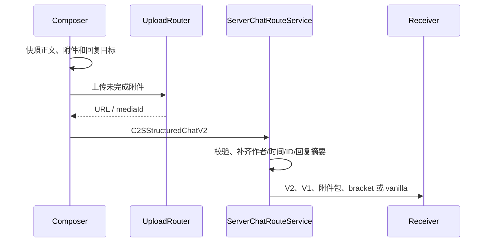

# 协议与服务端路由

## 目标与边界

协议同时解决三件事：新客户端的结构化聊天、服务端媒体和 metadata、旧客户端的可读降级。客户端提交是不可信输入；服务端广播的 envelope 才是身份、时间、消息 ID 和回复摘要的可信来源。

## 数据模型

| 模型 | 当前 schema | 用途 |
| --- | --- | --- |
| `StructuredChatMessage` | 1 | 旧结构化兼容模型；不承载回复和撤回同步。 |
| `StructuredChatSubmission` | 2 | C2S 提交正文、segments、附件和 `replyToMessageId`。 |
| `StructuredChatEnvelope` | 2 | 服务端校验后广播可信消息。 |
| `StructuredChatMutation` | 1 | 独立广播撤回状态。 |
| `StructuredAttachment` | 1 | 附件 ID、媒体 ID、类型、显示名和 URL 引用。 |

`StructuredChatProtocolLimits` 当前限制：wire JSON 48 KiB、JSON 深度 32、附件最多 8 个、segments 最多 64 个、正文 2048 字符、URL 2048 字符、消息 ID 64 字符。限制是协议边界，不等同于客户端文件大小上限。

## Payload 分类

### 聊天

```text
C2SChatInputMode
C2SStructuredChatMessage / C2SStructuredChatV2
C2SRetractChatMessage
C2SRequestChatHistory
S2CStructuredChatMessage / S2CStructuredChatV2
S2CStructuredChatAttachment
S2CChatMutation
S2CChatHistoryEntry / S2CChatHistoryComplete
```

### 附件和媒体

```text
C2SAttachMetadata / C2SRequestAttachmentMeta
S2CAttachmentCapability / S2CAttachmentAck / S2CAttachmentMeta / S2CAttachmentError
S2CCapability
C2SUploadInit / C2SUploadChunk
S2CUploadAck
C2SRequestMedia
S2CMediaInit / S2CMediaChunk / S2CMediaError
```

所有 payload 通过 `ServerMediaPayloads.registerTypes(...)` 经加载器的 `NetworkRegistrar` 注册。Fabric 和 NeoForge 只负责绑定实现，不改变公共模型。

## 发送与路由



服务端路由按接收端能力选择路线：

| 接收端能力 | 路线 | 语义 |
| --- | --- | --- |
| 支持 schema 2 | `S2CStructuredChatV2` | 保留可信作者、时间、回复和后续 mutation。 |
| 仅支持 schema 1 | `S2CStructuredChatMessage` | 保留正文和附件，不保证 schema 2 语义。 |
| 仅支持附件兼容包 | `S2CStructuredChatAttachment` | 发送附件富媒体兼容数据。 |
| 支持 bracket | 标准 bracket 文本 | `ChatUpgrade` 或图片 `CICode` 标签。 |
| vanilla | 安全文本 | 保证可读，不保证富媒体。 |

COMPAT 客户端的无附件纯文本应避免接收结构化纯文本包，以保留原版显示链路。

## 回复与撤回

`replyToMessageId` 只由 schema 2 可靠承载。服务端根据近期可信消息生成 `StructuredReplySummary`；客户端不能仅凭显示文本伪造回复事实。

撤回通过 `C2SRetractChatMessage` 请求，服务端按连接玩家 UUID 和消息所有权校验。成功后广播 `S2CChatMutation`；旧客户端已经显示的 bracket 或 vanilla 文本不能追溯删除。

## bracket fallback

支持的文本形式：

```text
[[ChatUpgrade,url=...,name=...,type=image]]
[[CICode,url=...]]
```

- `ChatUpgrade` 是标准标签。
- `CICode` 是可由 `ciCompatibility` 选择的图片兼容标签。
- 新客户端解析后写入统一状态层；旧客户端继续按文本协议处理。
- 服务端根据结构化附件重建降级内容，不把客户端传来的 fallback 字符串当作唯一事实。

## 媒体引用与能力

`chat-upgrade://media/<type>/<mediaId>` 是服务端内部媒体引用。接收端必须通过媒体请求 payload 获取字节，不能把它直接交给外部 HTTP loader。

能力与安全规则：

- 发送自定义 payload 前使用 `canSend(...)` 或等价能力 gate。
- 服务端校验 schema、字段长度、附件数量、上传大小、分块大小、TTL、并发和速率。
- 客户端接收受 `maxReceiveBytes` 约束。
- metadata 失败不得阻断已选定的安全消息路由。
- 服务端不能信任客户端作者、时间、消息 ID、撤回权限或 fallback 文本。

## 修改协议时

同步更新模型、wire codec、payload 注册、服务端路由、客户端接收、降级文本和测试。协议字段的变更必须说明旧客户端看到的结果；仅更新本文档不构成协议兼容。