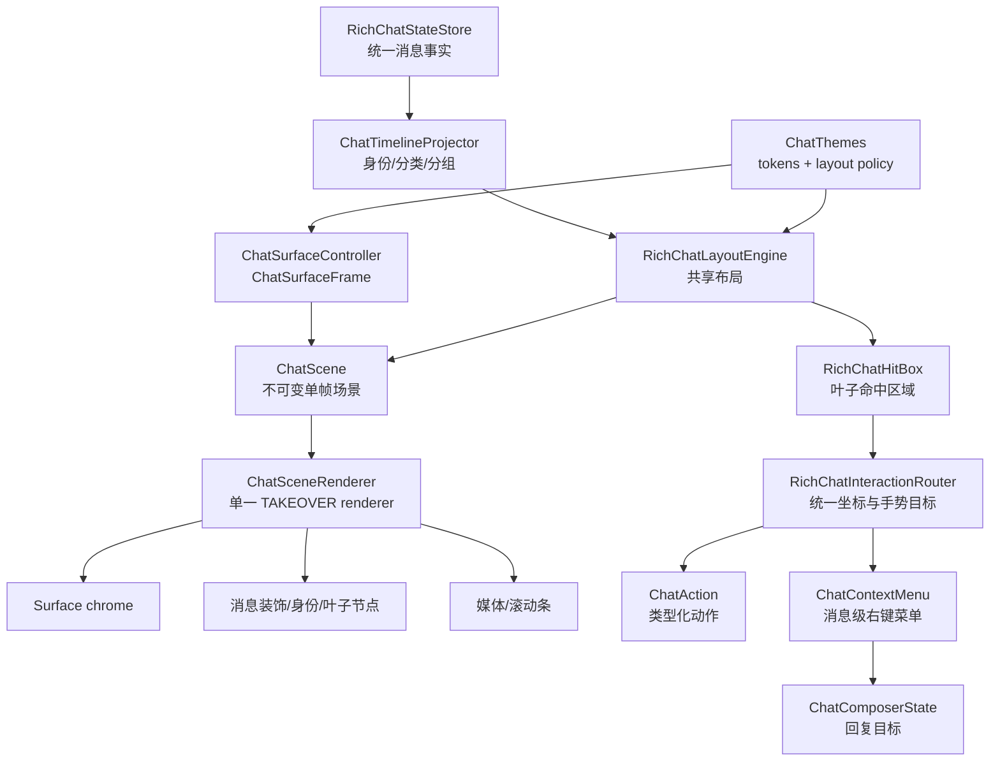

# RichChatViewport 实现

这篇文档说明 `TAKEOVER` 下完整聊天 surface 如何从统一消息状态生成可渲染、可点击、可滚动的富媒体场景。

## 核心结论

`TAKEOVER` 已由单一 scene/layout/render 管线拥有聊天 surface：

```text
RichChatMessage
  -> ChatTimelineProjection
  -> RichChatMessageLayout
  -> ChatScene
  -> ChatSceneRenderer
```

`ChatSurfaceController` 提供打开面板或关闭 HUD 的不可变 `ChatSurfaceFrame`。`ChatScene` 将 frame、timeline 布局和叶子节点组合为单帧场景；`ChatSceneRenderer` 统一绘制 surface chrome、消息装饰、身份、回复/删除节点、媒体和滚动条。

`COMPAT_TEXT_VANILLA` 不经过这条 TAKEOVER 管线。它继续使用 Minecraft 原版 `ChatComponent -> GuiMessage -> 原版布局/绘制`，不读取 TAKEOVER 的 metrics、坐标或运行时主题。

## 层级结构



## 事实层

主要文件：

- `src/common/src/main/java/com/chat/upgrade/client/ui/chat/state/RichChatMessage.java`
- `src/common/src/main/java/com/chat/upgrade/client/ui/chat/state/RichChatStateStore.java`
- `src/common/src/main/java/com/chat/upgrade/client/ui/chat/state/RichChatIngress.java`

`RichChatMessage` 表示一条聊天消息的事实：

| 字段 | 含义 |
| --- | --- |
| `messageId` | 消息唯一标识；可信增强消息由服务端生成，本地兼容消息可生成本地 ID。 |
| `author` / `kind` | 解析后的作者身份和消息语义分类。 |
| `serverTimestampMs` | 服务端时间；旧链路不可用时为 `0`。 |
| `replyTo` | 服务端确认的回复摘要；客户端不自行推断。 |
| `component` / `plainText` | 当前可见文本组件和纯文本。 |
| `fallbackText` | 降级文本，通常用于 bracket/vanilla。 |
| `attachments` | 图片、音频、视频等附件。 |
| `inlineEmojiSlots` | 表情 slot，布局时分配到文本行。 |
| `source` | 消息来源，如 vanilla、结构化包、bracket 协议。 |
| `status` | 可见或已删除状态；删除会清空正文、附件、表情和签名。 |

事实层不保存“这一行在哪里画”，只保存“这条消息是什么”。

## 布局层

主要文件：

- `src/common/src/main/java/com/chat/upgrade/client/ui/chat/viewport/RichChatLayoutEngine.java`
- `src/common/src/main/java/com/chat/upgrade/client/ui/chat/viewport/RichChatLayout.java`
- `src/common/src/main/java/com/chat/upgrade/client/ui/chat/viewport/RichChatMessageLayout.java`
- `src/common/src/main/java/com/chat/upgrade/client/ui/chat/viewport/RichChatMediaSizing.java`

布局层把 oldest-first timeline 投影转成内容局部坐标系下的布局结果：

```text
RichChatStateStore.snapshotNewestFirst()
  -> ChatTimelineProjector.projectOldestFirst()
  -> RichChatLayoutEngine 按 ChatLayoutPolicy 布局
  -> RichChatMessageLayout(bounds / visualBounds / identityBounds)
  -> RichChatRenderNode + RichChatHitBox
```

`ChatLayoutPolicy` 在布局阶段一次决定身份 gutter、消息内边距、组间距、换行宽度和消息装饰形态。文本、媒体、背景与 hit box 都从同一布局坐标生成，renderer 不再按主题二次偏移，避免视觉位置与点击区域漂移。

当前文本使用 Minecraft `Font.split` 换行，这是 TAKEOVER 的布局实现选择，不是原版 `GuiMessage.Line` 模型。附件高度由 `RichChatMediaSizing` 统一决定。

## 渲染节点

主要文件：

- `src/common/src/main/java/com/chat/upgrade/client/ui/chat/viewport/RichChatRenderNode.java`
- `src/common/src/main/java/com/chat/upgrade/client/ui/chat/viewport/RichChatRenderNodeKind.java`

节点类型包括：

| 节点 | 含义 |
| --- | --- |
| `TEXT` | 普通文本行。 |
| `SYSTEM` | 系统文本行。 |
| `REPLY` | 可信服务端回复摘要。 |
| `DELETED` | 已撤回消息的脱敏占位。 |
| `IMAGE` | 图片附件。 |
| `AUDIO` | 音频播放器。 |
| `VIDEO` | 视频播放器。 |
| `ATTACHMENT_PENDING` | 附件等待状态。 |
| `ATTACHMENT_FAILED` | 附件失败状态。 |

每个节点拥有自己的 bounds、顺序、文本或附件对象。气泡/卡片边界、身份 gutter 和组位置属于 `RichChatMessageLayout` 与 timeline 投影，不由叶子节点重复推断。

## 命中框

主要文件：

- `src/common/src/main/java/com/chat/upgrade/client/ui/chat/viewport/RichChatHitBox.java`
- `src/common/src/main/java/com/chat/upgrade/client/ui/chat/viewport/RichChatHitBoxKind.java`
- `src/common/src/main/java/com/chat/upgrade/client/ui/chat/viewport/RichChatInteractionRouter.java`

`RichChatHitBox` 表示一个可交互区域，不依赖原版聊天行。

它可以表示：

- 图片预览点击区域。
- 音频播放、循环、打开、浮窗、进度条区域。
- 视频播放、预览、seek 区域。
- 表情图片区域。

消息级动作不伪造成叶子 hit box。`RichChatInteractionRouter` 还会保存当前可见 `RichChatMessageLayout`，右键手势先解析消息范围，再由动作目录基于消息事实生成菜单。

## 类型化动作与回复 composer

主要文件：

- `src/common/src/main/java/com/chat/upgrade/client/ui/chat/interaction/ChatAction.java`
- `src/common/src/main/java/com/chat/upgrade/client/ui/chat/interaction/ChatGestureTarget.java`
- `src/common/src/main/java/com/chat/upgrade/client/ui/chat/interaction/ChatMessageActionCatalog.java`
- `src/common/src/main/java/com/chat/upgrade/client/ui/chat/interaction/ChatContextMenu.java`
- `src/common/src/main/java/com/chat/upgrade/client/ui/chat/interaction/ChatMessageActionExecutor.java`
- `src/common/src/main/java/com/chat/upgrade/client/ui/chat/input/ChatComposerState.java`
- `src/common/src/main/java/com/chat/upgrade/client/ui/chat/input/ChatComposerRenderer.java`

主、次按键统一解析为 `ChatGestureTarget`。叶子媒体动作转换为 `ChatAction` 后再由 `ChatActionStyleAdapter` 适配到 Minecraft 点击事件，回复、复制、撤回等消息级动作则直接由 `ChatScreen` 执行，不再污染 renderer。

右键菜单与 hover 动作条共享同一动作目录，并只对当前 TAKEOVER 可见消息生成可执行项：

- 可信 V2 消息可以设为回复目标。
- 有可复制正文、选中文本或附件 URL 的消息可以复制。
- 玩家消息可以提及作者、查看资料、本地隐藏或屏蔽作者；取消屏蔽也可通过命令与反馈入口完成。
- 可信且由本地玩家发送的消息可以请求服务端撤回。
- 调试动作仅在 `debugChatActions` 开启时出现。

composer 预览只保存 `messageId`、作者快照和摘要。发送时正文与附件共用 `replyToMessageId`；回复语义无法通过 V2 发送时不会静默降级成普通消息。所有叶子与消息目标都只从当前 viewport 可见布局生成，滚动后的不可见区域不会被误命中。

## 渲染层

主要文件：

- `src/common/src/main/java/com/chat/upgrade/client/ui/chat/scene/ChatScene.java`
- `src/common/src/main/java/com/chat/upgrade/client/ui/chat/scene/ChatSceneRenderer.java`
- `src/common/src/main/java/com/chat/upgrade/client/mixin/ChatComponentRichViewportMixin.java`
- `src/common/src/main/java/com/chat/upgrade/client/ui/chat/viewport/RichChatMediaRenderer.java`

渲染流程：

```text
ChatComponent 生命周期接入
  -> TAKEOVER gate 判断
  -> ChatSurfaceController.synchronize()
  -> ChatTimelineProjector + RichChatLayoutEngine
  -> 创建不可变 ChatScene
  -> 绘制 surface chrome
  -> 对内容区开启 scissor 并平移到内容原点
  -> ChatSceneRenderer 绘制消息装饰、身份和可见叶子节点
  -> finally 恢复 pose 并关闭 scissor
  -> 绘制不属于内容裁切的 chrome / scrollbar
```

普通文本和媒体都在同一个 timeline 裁切范围内渲染。surface 几何和 scissor 使用 GUI 绝对坐标；消息、空态和 `RichChatRenderNode` 使用内容局部坐标。Mixin 只负责生命周期、裁切、pose 和共享场景调用，不再包含主题颜色或消息装饰分支。

## 运行时主题

三个稳定主题 ID 共用上述 scene/layout/render 管线：

- `modern_bubble`
- `compact_feed`
- `native_enhanced`

`ChatThemeTokens` 提供 surface、消息、身份、回复、删除、媒体、滚动条和 composer 的视觉语义；`ChatLayoutPolicy` 提供会改变布局与命中框的尺寸策略。主题切换在下一帧同步 `ChatSurfaceFrame` 并重建必要布局，不修改消息事实或协议能力。

## 表情链路

主要文件：

- `src/common/src/main/java/com/chat/upgrade/client/ui/chat/InlineEmojiCodec.java`
- `src/common/src/main/java/com/chat/upgrade/client/ui/chat/InlineEmojiCoordinator.java`
- `src/common/src/main/java/com/chat/upgrade/client/ui/chat/InlineEmojiSlot.java`

表情流程：

```text
消息文本中的 [:token]
  -> InlineEmojiCodec 替换为占位宽度
  -> 生成 InlineEmojiSlot
  -> RichChatMessage 保存 slots
  -> RichChatLayoutEngine 按文本行消费 slots
  -> RichChatRenderNode 保存行级 slots
  -> RichChatMediaRenderer 叠加绘制表情图片
  -> RichChatHitBox 支持可见区域内命中
```

这条链路不再依赖旧 `GuiMessage.Line` 绘制消费表情 slot。

## 滚动模型

主要文件：

- `src/common/src/main/java/com/chat/upgrade/client/ui/chat/viewport/RichChatViewportState.java`
- `src/common/src/main/java/com/chat/upgrade/client/mixin/ChatScreenSmoothScrollMixin.java`
- `src/common/src/main/java/com/chat/upgrade/client/mixin/ChatScreenScrollbarDragMixin.java`

滚动状态是像素级：

| 状态 | 含义 |
| --- | --- |
| `scrollPx` | 目标滚动位置。 |
| `visualScrollPx` | 带平滑动画的视觉滚动位置。 |
| `smoothOffsetPx` | 滚轮过渡偏移。 |
| `totalHeight` | 内容总高度。 |
| `visibleHeight` | 可视窗口高度。 |
| `bottomPinned` | 是否贴底。 |

鼠标滚轮会产生平滑过渡。拖拽滚动条直接设置像素位置，不做动画。

## 自定义渲染能力边界

TAKEOVER 已拥有完整聊天 surface，可独立定义面板 chrome、timeline 布局、主题和内容裁切，不必遵守原版聊天行规范。

仍保留的边界：

- 面板几何来自 `ChatPanelGeometry`，左下锚定并由 `ChatSurfaceController` 持久化；屏幕大小变化时会重新归一化。
- 所有 timeline 绘制和交互必须使用同一布局快照，不应在 renderer 内制造额外坐标。
- 消息右键菜单、回复预览和类型化动作属于独立交互/composer 模块，不由 scene renderer 保存状态。
- composer 采用最多 8 项的有序附件集合；chip 的单项移除、并发上传和批次快照属于 input 模块，不由 scene renderer 保存状态。
- 命令桥接通过原版建议与发送管线执行，视觉焦点由 composer 控制。
- 玩家身份优先按 UUID 从 `PlayerInfo` 或已加载玩家解析皮肤纹理，头像绘制 8×8 头部与帽层；无法取得纹理时使用稳定色块/glyph 回退。
- 网络协议和 fallback 策略仍要兼容服务端与旧客户端。
- `COMPAT_TEXT_VANILLA` 必须继续隔离原版文本布局和绘制。