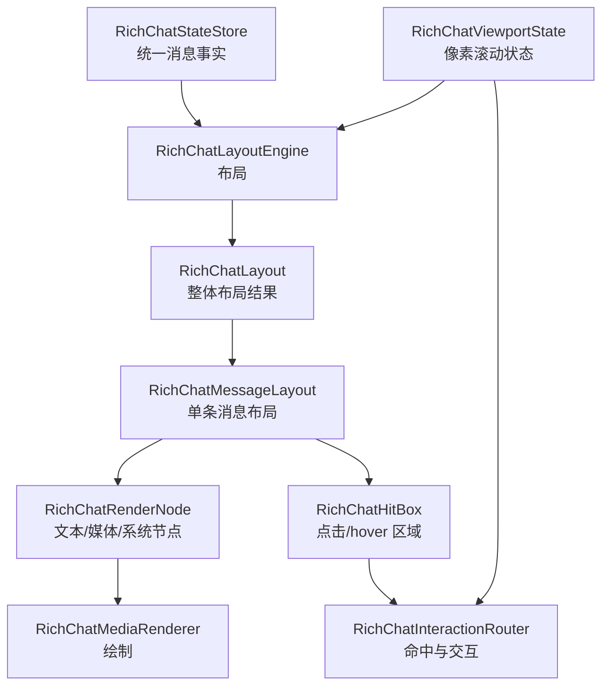

# RichChatViewport 实现

这篇文档说明 `TAKEOVER` 下聊天栏内容区如何从统一消息状态变成可渲染、可点击、可滚动的富媒体界面。

## 核心结论

`TAKEOVER` 下聊天栏内容区已经是自定义 viewport 架构：

```text
RichChatMessage
  -> RichChatMessageLayout
  -> RichChatRenderNode
  -> RichChatHitBox
  -> RichChatMediaRenderer
  -> RichChatInteractionRouter
```

原版 `ChatComponent` 仍提供外壳、位置、尺寸、缩放、透明度和生命周期，但内容怎么排、怎么画、怎么点，主要由 `RichChatViewport` 体系决定。

## 层级结构



## 事实层

主要文件：

- `src/common/src/main/java/com/chat/upgrade/client/ui/chat/state/RichChatMessage.java`
- `src/common/src/main/java/com/chat/upgrade/client/ui/chat/state/RichChatStateStore.java`
- `src/common/src/main/java/com/chat/upgrade/client/ui/chat/state/RichChatIngress.java`

`RichChatMessage` 表示一条聊天消息的事实：

| 字段 | 含义 |
| --- | --- |
| `messageId` | 消息唯一标识；为空时生成本地 ID。 |
| `senderName` | 发送者。 |
| `component` | 进入渲染的 Minecraft 文本组件。 |
| `plainText` | 纯文本内容。 |
| `fallbackText` | 降级文本，通常用于 bracket/vanilla。 |
| `attachments` | 图片、音频、视频等附件。 |
| `inlineEmojiSlots` | 表情 slot，布局时分配到文本行。 |
| `source` | 消息来源，如 vanilla、结构化包、bracket 协议。 |
| `status` | 可见、删除等状态。 |

事实层不保存“这一行在哪里画”，只保存“这条消息是什么”。

## 布局层

主要文件：

- `src/common/src/main/java/com/chat/upgrade/client/ui/chat/viewport/RichChatLayoutEngine.java`
- `src/common/src/main/java/com/chat/upgrade/client/ui/chat/viewport/RichChatLayout.java`
- `src/common/src/main/java/com/chat/upgrade/client/ui/chat/viewport/RichChatMessageLayout.java`
- `src/common/src/main/java/com/chat/upgrade/client/ui/chat/viewport/RichChatMediaSizing.java`

布局层把消息事实转成 viewport 坐标系下的布局结果：

```text
RichChatStateStore.snapshotNewestFirst()
  -> 反转为 oldestFirst
  -> 每条消息生成 RichChatMessageLayout
  -> 每个文本行和附件生成 RichChatRenderNode
  -> 每个可交互区域生成 RichChatHitBox
```

当前文本仍使用 Minecraft `Font.split` 换行，这是实现选择，不是原版聊天行模型。附件高度由 `RichChatMediaSizing` 统一决定。

## 渲染节点

主要文件：

- `src/common/src/main/java/com/chat/upgrade/client/ui/chat/viewport/RichChatRenderNode.java`
- `src/common/src/main/java/com/chat/upgrade/client/ui/chat/viewport/RichChatRenderNodeKind.java`

节点类型包括：

| 节点 | 含义 |
| --- | --- |
| `TEXT` | 普通文本行。 |
| `SYSTEM` | 系统文本行。 |
| `IMAGE` | 图片附件。 |
| `AUDIO` | 音频播放器。 |
| `VIDEO` | 视频播放器。 |
| `ATTACHMENT_PENDING` | 附件等待状态。 |
| `ATTACHMENT_FAILED` | 附件失败状态。 |

每个节点拥有自己的 bounds、顺序、文本或附件对象。后续要添加气泡、头像、回复块、按钮组，也应先添加新的节点模型或在现有节点外扩展布局数据。

## 命中框

主要文件：

- `src/common/src/main/java/com/chat/upgrade/client/ui/chat/viewport/RichChatHitBox.java`
- `src/common/src/main/java/com/chat/upgrade/client/ui/chat/viewport/RichChatHitBoxKind.java`
- `src/common/src/main/java/com/chat/upgrade/client/ui/chat/viewport/RichChatInteractionRouter.java`

`RichChatHitBox` 表示一个可交互区域，不依赖原版聊天行。

它可以表示：

- 图片预览点击区域。
- 音频播放、循环、打开、浮窗、进度条区域。
- 视频播放、预览、seek 区域。
- 表情图片区域。
- 后续扩展的消息操作按钮。

交互只在当前 viewport 可见区域内生效，滚动后不可见区域不会被误命中。

## 渲染层

主要文件：

- `src/common/src/main/java/com/chat/upgrade/client/mixin/ChatComponentRichViewportMixin.java`
- `src/common/src/main/java/com/chat/upgrade/client/ui/chat/viewport/RichChatMediaRenderer.java`
- `src/common/src/main/java/com/chat/upgrade/client/ui/chat/ChatUpgradeChatRenderState.java`

渲染流程：

```text
ChatComponent 提取渲染状态
  -> TAKEOVER gate 判断
  -> 计算 Vanilla shell metrics
  -> RichChatLayoutEngine layoutFromStore
  -> RichChatViewportState 更新滚动边界
  -> 开启 scissor 裁切
  -> 绘制消息背景
  -> 绘制每个可见 RenderNode
  -> 绘制滚动条
  -> 处理 hover / tooltip / cursor
```

普通文本和媒体都在同一个 viewport 裁切范围里渲染。文本不再绕回原版 `GuiMessage.Line` 绘制主路径。

## 表情链路

主要文件：

- `src/common/src/main/java/com/chat/upgrade/client/ui/chat/InlineEmojiCodec.java`
- `src/common/src/main/java/com/chat/upgrade/client/ui/chat/InlineEmojiCoordinator.java`
- `src/common/src/main/java/com/chat/upgrade/client/ui/chat/InlineEmojiSlot.java`

表情流程：

```text
消息文本中的 [:token]
  -> InlineEmojiCodec 替换为占位宽度
  -> 生成 InlineEmojiSlot
  -> RichChatMessage 保存 slots
  -> RichChatLayoutEngine 按文本行消费 slots
  -> RichChatRenderNode 保存行级 slots
  -> RichChatMediaRenderer 叠加绘制表情图片
  -> RichChatHitBox 支持可见区域内命中
```

这条链路不再依赖旧 `GuiMessage.Line` 绘制消费表情 slot。

## 滚动模型

主要文件：

- `src/common/src/main/java/com/chat/upgrade/client/ui/chat/viewport/RichChatViewportState.java`
- `src/common/src/main/java/com/chat/upgrade/client/mixin/ChatScreenSmoothScrollMixin.java`
- `src/common/src/main/java/com/chat/upgrade/client/mixin/ChatScreenScrollbarDragMixin.java`

滚动状态是像素级：

| 状态 | 含义 |
| --- | --- |
| `scrollPx` | 目标滚动位置。 |
| `visualScrollPx` | 带平滑动画的视觉滚动位置。 |
| `smoothOffsetPx` | 滚轮过渡偏移。 |
| `totalHeight` | 内容总高度。 |
| `visibleHeight` | 可视窗口高度。 |
| `bottomPinned` | 是否贴底。 |

鼠标滚轮会产生平滑过渡。拖拽滚动条直接设置像素位置，不做动画。

## 自定义渲染能力边界

在聊天栏内容区内，TAKEOVER 可以自由定义布局和渲染，不必遵守原版聊天行规范。

仍保留的边界：

- 聊天栏外壳位置、大小、缩放来自原版 shell。
- 不应默认画出聊天栏 viewport 裁切范围外。
- 命令输入仍应保持原版链路。
- 网络协议和 fallback 策略仍要兼容服务端与旧客户端。

如果未来要完全替换外壳，那是另一阶段：需要替换 ChatScreen/ChatComponent 外层生命周期，而不仅是 viewport。